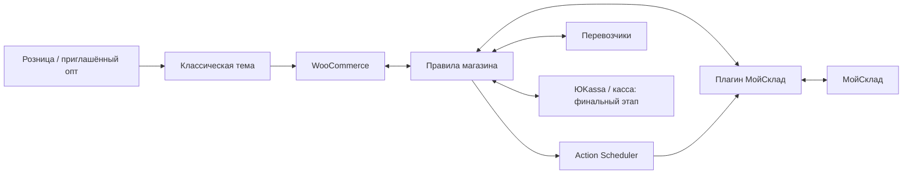

# Архитектура

Назначение: краткая карта утверждённого устройства, ответственности и ещё не доказанных возможностей. Полные требования и таблицы переходов — в [SPEC](SPEC.md#архитектура-и-границы-компонентов), реализация и оперативная готовность — в [STATUS](STATUS.md).

## Статус решений и реализации

**Утверждено владельцем:** WordPress/WooCommerce, собственная классическая тема по его вёрстке, два собственных плагина, классические корзина и оформление, MariaDB, Action Scheduler с системным запуском. Обоснования — [DECISIONS](DECISIONS.md).

**Контракты и совместимость:** внутренние интерфейсы и модель событий закреплены в [CONTRACTS](CONTRACTS.md), точные версии локальной базы и предварительный аудит модулей — в [COMPATIBILITY](COMPATIBILITY.md). Наличие каркаса, модели либо декларации совместимости не доказывает готовность покупательского сценария. Оперативное состояние реализации хранится только в STATUS, испытания — в ACCEPTANCE.

## Компоненты и границы

| Компонент | Ответственность и интерфейс |
| --- | --- |
| WordPress | Аккаунты, медиа, страницы и административные права |
| WooCommerce | Товары/варианты, классическая корзина/оформление, снимок заказа, кабинет, суммы; доступ к заказам через CRUD API, поддержка HPOS |
| Классическая тема | Вёрстка владельца, адаптивность и формы; использует подготовленные данные и хуки, необходимые переопределения шаблонов проверяются при обновлениях |
| Плагин правил магазина | Права и приглашения, ценовой контекст, публикация/видимость, бизнес-состояния, единственный контур резервов, уведомления, трек-номер |
| Плагин МойСклад | Авторизация, импорт/нормализация, ID связей, внешние документы, резервирование, решения/отгрузки и диагностика; возвращает успех, отказ либо неизвестный результат |
| Action Scheduler | Сохранённые задания, повторы и восстановление; приоритет денег/резервов/отмен/заказов перед каталогом, фотографии отдельно |
| Адаптеры доставки | Пункты, тарифы, снимок расчёта, автоматические статусы и проверка вручения; отправления создаёт менеджер вне сайта |
| Платёжный модуль и кассовый адаптер | Денежные операции выполняет выбранный модуль ЮKassa через поддерживаемые расширения; кассовая цепочка определяется после проверки оборудования |
| VPS, почта, приватный S3 | PHP/база/HTTPS, системные задания, доменная почта, защищённые копии и проверенное восстановление |

Минимальные границы собственных плагинов: снимок товара/модификации, запрос связанного заказа, установка/снятие резерва, результат операции, решение менеджера и состояние отгрузки. Сообщения содержат ID источника, ID заказа сайта и номер операции. Точные поля и поиск внешнего документа определяются ранним контрольным обменом. Прямые вызовы внешнего API из темы и изменения файлов сторонних модулей запрещены.

## Владение данными

| Данные | Основной владелец |
| --- | --- |
| ID, артикул, модификации, размеры/цвета, цены, физическое количество, архив и внешние резервы | МойСклад; исходные значения и сопоставления проверяются по ID |
| Название, описание, фото/порядок, публикация, категории, бренд, SEO, редакторские характеристики, вес/габариты/упаковка | Сайт после первоначального заполнения; обычный обмен не заменяет ручные значения |
| Заказ и подтверждённые суммы | WooCommerce: неизменяемый оплаченный розничный снимок; оптовые изменения создают согласованную версию с историей |
| Оптовое решение, сборка, отгрузка | Связанные документы МойСклад; смена исполнения не доказывает розничную оплату |
| Оплата и денежный возврат | Подтверждённые объекты ЮKassa, отдельно от физического возврата товара |
| Пункт и тариф | Перевозчик при выборе, затем сохранённый снимок заказа |
| Трек и событие доставки | Трек вводит менеджер; события подтверждает перевозчик либо менеджер с датой и основанием |
| Коды экземпляров | Связанная отгрузка МойСклад; полнота и способ передачи ещё не доказаны |

Полная таблица полей и минимальных сохраняемых связей — в [SPEC](SPEC.md#источники-истины-и-сохраняемые-связи). Публичные данные WooCommerce используют розничную цену; оптовая хранится отдельно, проверяется сервером и не попадает гостям через API/кеш.

## Ключевые потоки

- **Каталог:** импорт по устойчивым ID, новые карточки — черновики, новые варианты — отключены до проверки. После импорта редакторские поля принадлежат сайту. Обмен каждые 5 минут, полная сверка ежедневно; SLA обновления не более 10 минут на согласованном объёме. Ошибка API не подтверждает удаление, отсутствие цены или обнуление остатка.
- **Розница:** сохранить заказ/задание → проверить актуальные цену и наличие → получить полный внешний резерв → разрешить оплату до исходного срока 1 час → подтвердить платежом ЮKassa → исполнить через МойСклад. Сумма включает товары и доставку. Поздняя оплата сохраняется: полный повторный резерв либо решение менеджера, без автоматического возврата из-за нехватки.
- **Опт:** одноразовое приглашение на 24 часа связывает один аккаунт с одним существующим контрагентом → заявка без онлайн-оплаты → полный резерв на 24 часа → решение менеджера в МойСклад. Подтверждённый резерв не снимается первоначальным таймером; изменения состава версионируются. Доставка, расчёты и УПД СБИС остаются ручным процессом.
- **Резерв и неизвестный результат:** один контур согласует внешние резервы, локальные незавершённые удержания и штатные действия WooCommerce. После таймаута выяснить фактический результат до повтора; конфликтующие операции сериализуются. Блокировка сайта не доказывает атомарность между внешними каналами.
- **Доставка и чеки:** полная отправка из одной точки по России, СДЭК ПВЗ/Почта отделение. Менеджер создаёт отправление и вводит трек; адаптер проверяет события, направление и фактическое вручение. Коды сканируются в МойСклад один раз. Исполнитель и событие чека определяются проверенной кассовой схемой; повтор не создаёт второй чек.
- **Возврат и восстановление:** денежный возврат, товар, чек и маркировка учитываются отдельно. После восстановления базы сверить внешние деньги/заказы/резервы до возобновления исходящих действий. RPO базы ≤5 минут и RTO ≤4 часов доказываются испытанием; ежечасной копии самой по себе недостаточно.

Таблица «событие → проверенные исходные данные → единственный исполнитель → состояние → резерв → письмо» находится в [CONTRACTS](CONTRACTS.md#события-и-единственный-исполнитель). При реализации согласовать `is_paid`, `needs_payment`, статусы, количество и уведомления WooCommerce. Полные правила — [состояния заказа](SPEC.md#состояния-заказа-и-устойчивость-к-повторам).

## Уточнение контура склада

После исходного ТЗ владелец утвердил один выбранный магазин и его учётный склад: [REQ-320](SPEC.md#req-320), [DEC-015](DECISIONS.md#dec-015). Ранее описанный общий пул применяется только внутри выбранного учётного склада; остальные склады не участвуют в доступном количестве. До реального обмена должны быть подтверждены название/ID. Все прежние условия конкуренции и незавершённых локальных удержаний сохраняются. Ни один реальный изменяющий запрос не разрешён без согласования объектов и операций по [REQ-321](SPEC.md#req-321).

## Технические вопросы и контрольные границы

Надёжное исполнение TASK-013: CRUD-метаданные заказа `_suhoput_commands` сохраняют команды до записи журнала и постановки задания; циклическая порционная сверка восстанавливает пропущенное намерение. `Worker` имеет одного зарегистрированного исполнителя операции/события, раздельные пути отправки и сверки. После unknown выполняется только сверка; автоматический новый POST не разрешается. Результат сохраняется до локальной проекции, её окончание — отдельно. Проекции повторяемы и используют CRUD/дедупликацию уведомлений, внешние эффекты требуют нового намерения. Блокировки заказа MariaDB живут на соединении и снимаются при гибели процесса. Транспортные адаптеры и бизнес-переходы выполняются зависимыми задачами; см. [DEC-018](DECISIONS.md#dec-018).

Пункты ниже задают обязательные контрольные границы и не заменяют бизнес-требования. Предварительные чтения/имитации не доказывают полный контур; конкретные выполненные испытания находятся в ACCEPTANCE, препятствия и действия владельца — в STATUS.

| Вопрос | Что доказать до зависимой реализации |
| --- | --- |
| Каталог и цены | Реальные ID/единицы/валюта/наследование, страницы API, объём, возобновление и время обмена |
| Выбранный склад и конкуренция | Исключение остальных складов/ожиданий, полный резерв выбранного пула, снятие/отгрузка, последний товар одновременно с менеджером/другими каналами |
| Документы и контрагенты | Сопоставление после таймаута, отсутствие дублей и устойчивость журналов операций |
| Маркировка | Полные коды одежды/обуви, разделители/формат, два экземпляра одного варианта и результаты разрешительной проверки; имя API-поля не служит доказательством |
| Касса | ККТ/ФН/ПО/ОФД, регистрация, совместимость, ФФД, разрешительная проверка/ТС ПИоТ, исполнители чеков и вывода из оборота |
| Доставка | API-доступ к вручную созданным отправлениям, договоры/лимиты, события/направление/задержки, упаковка и тариф |
| Версии и модули | WordPress/WooCommerce/PHP/HPOS/очередь/классическое оформление; лицензии, стоимость, обновление и замена модулей |
| Платёжный модуль | Заранее — документация/исходники и точки расширения; установка и фактическая денежная/кассовая цепочка только последними |
| Эксплуатация | Фактический VPS, безопасный стенд, почта, копии/журналы MariaDB, измеренное восстановление и сверка очередей |

Список официальных ссылок сохранён в [SPEC](SPEC.md#официальная-документация-для-агента); исследование — в COMPATIBILITY и [ACCESS](ACCESS.md). Отчёт испытания должен содержать дату, версии, конкретный вывод и доказательства контрольного сценария.
