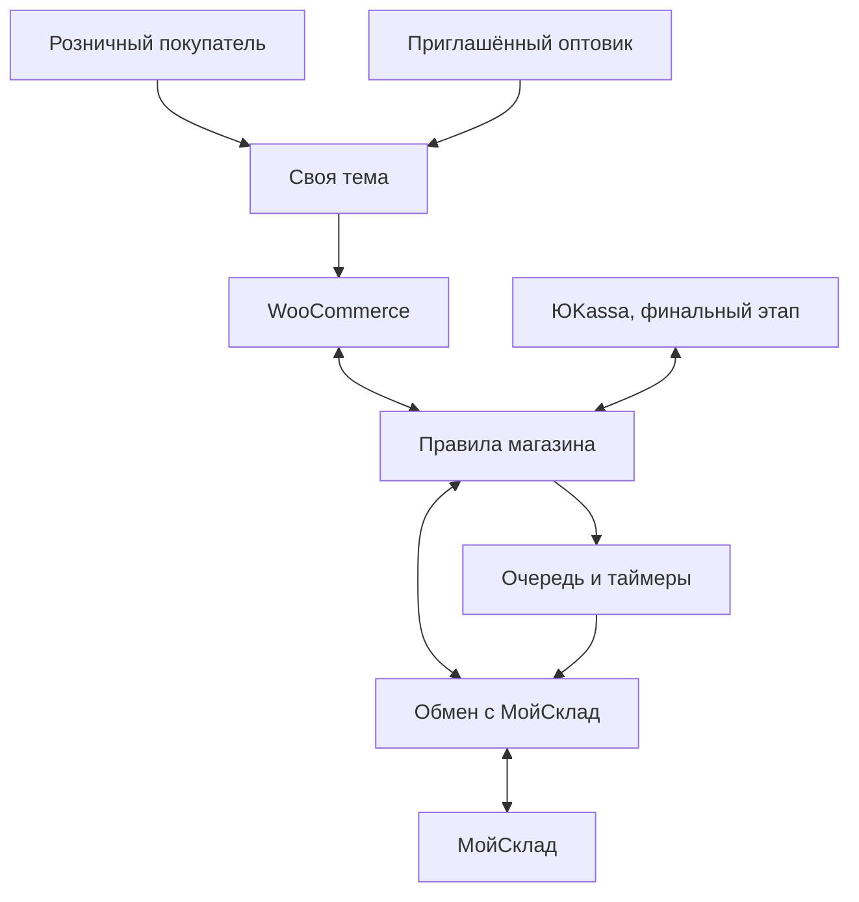

# ТЗ для Codex — интернет-магазин на WordPress и WooCommerce

Дата: 8 октября 2026 года.

Статус: согласованное техническое задание для передачи агенту Codex, 8 октября 2026 года. Архитектура и бизнес-правила утверждены владельцем, включая решения по аудиту. Маркировка сканируется в МойСклад при оформлении отгрузки. Технические возможности конкретных API, модулей, договоров и кассы проверяет агент во время разработки; согласование требований не заменяет эти проверки.

Создать с нуля интернет магазин на WordPress и WooCommerce, используя готовую вёрстку владельца. Магазин обслуживает розничных покупателей и приглашённых оптовых контрагентов. МойСклад является источником товаров, модификаций, цен и складских данных; заказы сайта поступают в МойСклад.

Документ фиксирует согласованные бизнес-правила, архитектуру, границы модулей, переходы состояний и критерии приёмки. Обсуждение модели кассы отложено по решению владельца: агент запросит необходимые сведения во время разработки, при переходе к проектированию зависящей от кассы части. Это не блокирует независимые работы. Установку, подключение и интеграционные испытания ЮKassa выполнять строго последним этапом; к нему кассовая схема должна быть определена. До этого этапа разрешена подготовка интерфейсов оплаты и проверка логики на имитированных событиях в тестовом окружении.

## Согласованные требования

| Область | Требование |
| --- | --- |
| Исходное состояние | Новый проект с нуля. Готовая вёрстка HTML, CSS, JavaScript и изображения служат исходным дизайном. |
| Движок | WordPress и WooCommerce. |
| Архитектура | Своя классическая тема на основе готовой вёрстки; отдельные плагины правил магазина и обмена с МойСклад. |
| Розничный доступ | Каталог и розничные цены открыты без регистрации. Заказ доступен гостю; регистрация добровольная. |
| Оптовый доступ | Закрытый раздел с входом. Доступ выдаётся существующему контрагенту МойСклад по приглашению менеджера. |
| Аккаунт оптового контрагента | Одному оптовому контрагенту МойСклад соответствует один аккаунт магазина. Повторное приглашение использует существующую привязку. |
| Email и тип аккаунта | Один email соответствует одному аккаунту: либо розничному, либо оптовому. Создание второго аккаунта на тот же email запрещено; правило и ошибка повторной регистрации понятны пользователю. |
| История оптовика | В кабинете показываются только его заказы, оформленные на этом сайте. Прежние и вручную созданные заказы МойСклад не импортируются в историю кабинета. |
| Срок оптового приглашения | Одноразовая ссылка установки пароля действует 24 часа с момента создания приглашения. Менеджер может отправить новое приглашение, аннулирующее прежнюю ссылку. |
| Розничная цена | Тип цены «Розница» в МойСклад. |
| Оптовая цена | Тип цены «Цена продажи» в МойСклад. Одинаковый тип цен для всех оптовиков, без индивидуальных прайсов. |
| Скидки | Купонов и личных скидок в первой версии нет. |
| Отсутствующая цена | Товар или вариант без нужной цены скрывается в соответствующем каталоге; администратор видит проблему. Доступность для розницы и опта проверяется независимо. |
| Продавец | ИП на УСН «Доходы». По заявлению владельца применяется НДС 5%. |
| НДС в ценах | Обе импортируемые цены уже включают НДС 5%. Повторно прибавлять НДС к ним нельзя. |
| Маркировка | Маркированный ассортимент включает одежду и обувь. Учёт кодов «Честного Знака» и схему чеков предусмотреть в архитектуре до финального подключения ЮKassa. |
| Сканирование маркировки | Коды Data Matrix сканируются в МойСклад при оформлении отгрузки. |
| Оптовый ЭДО | УПД оформляются и передаются вручную через СБИС. Автоматизация СБИС не входит в первую версию магазина. |
| Облачная касса | Пока отсутствует. |
| Физическая касса | Кассовый аппарат имеется. Вопрос модели, кассовой программы и ОФД сейчас отложен. Агент уточняет данные во время разработки перед зависимой фискальной частью; к финальному подключению оплаты схема должна быть выбрана. |
| Структура товара | Один товар МойСклад становится одной карточкой WooCommerce. Его модификации становятся вариантами карточки. |
| Архив МойСклад | Архивные товары и модификации скрываются из розничного и оптового каталогов. Данные сайта и история заказов сохраняются. |
| Размеры и цвета | Импортируются существующие модификации. Несуществующие комбинации автоматически не создаются. |
| Объём каталога | По оценке владельца, от 1 001 до 10 000 модификаций. Точное количество товаров и модификаций уточнить при первой проверке API. |
| Первичное содержимое | При первом импорте название, фотографии и описание заполняются имеющимися данными МойСклад. |
| Публикация новых товаров | Новые карточки создаются как черновики; новые модификации опубликованной карточки отключены до проверки редактором. Публикация и включение выполняются вручную. |
| Фотография для публикации | До публикации карточки необходимо добавить хотя бы одну фотографию товара. Правило одинаково для розницы и опта. |
| Редактирование карточек | Название, фотографии и описание далее управляются в админке сайта. Регулярный обмен сохраняет ручные правки. |
| Обновляемые данные | Цены, доступное количество, модификации и архив обновляются из МойСклад с соблюдением таблицы владения полями; выполняется ежедневная полная контрольная сверка. |
| Плановый обмен | Цены, остатки и статусы заказов обновляются из МойСклад каждые 5 минут. Наличие дополнительно проверяется при оформлении перед резервированием. |
| Задержка цен и остатков | При штатной работе изменение в МойСклад должно отображаться на сайте не позднее чем через 10 минут. Проверить на согласованном объёме каталога. |
| Склады | Учитываются все склады; количество рассчитывается отдельно для каждой модификации. |
| Наличие | Для продажи учитываются фактические остатки за вычетом резервов. Ожидаемые поступления исключаются. |
| Поступление товара | По рабочему процессу владельца товар добавляется в МойСклад после фактического получения. Ожидаемый товар не продаётся и не резервируется. |
| Продажа отсутствующего товара | Заказ отсутствующих или полностью зарезервированных вариантов запрещён. Предзаказов в первой версии нет. |
| Товар без доступного остатка | Опубликованная карточка остаётся в каталоге с отметкой «Нет в наличии», если закончились все доступные варианты. Покупка возобновляется после появления доступного остатка. |
| Розничный заказ | Товар и рассчитанная доставка оплачиваются одним платежом через ЮKassa. До оплаты покупатель видит стоимость товаров, доставки и общую сумму. |
| Сценарий оплаты | Одностадийная оплата согласованными способами. Предавторизацию и рассрочку в первую версию не включать; их добавление требует отдельного решения. |
| Замена после оплаты | Исходный оплаченный состав сохраняется. Замена оформляется связанным возвратом и новым заказом после согласования с покупателем; автоматического возврата из-за нехватки товара нет. |
| Контрагенты розницы | Для каждого розничного покупателя создаётся отдельный контрагент МойСклад. Сохранять связь с ним и использовать её при повторных заказах. |
| Повторные гостевые заказы | Искать однозначное совпадение email и телефона среди розничных контрагентов, ранее созданных магазином. При отсутствии однозначного совпадения создавать нового контрагента. |
| Розничный резерв | Срок — 1 час от первой надёжной записи заказа WooCommerce при оформлении; очередь и повторная попытка оплаты его не продлевают. Действия при истечении зависят от подтверждённого состояния всех попыток платежа. |
| Поздняя оплата при наличии товара | Если после снятия резерва подтверждена оплата и доступен весь состав заказа, автоматически повторно зарезервировать его и продолжить выполнение после подтверждения полного резерва. |
| Поздняя оплата при отсутствии товара | Если после снятия резерва подтверждена оплата, а товара уже нет, передать заказ менеджеру для согласования с покупателем замены или возврата. Автоматический возврат в этом случае не выполнять. |
| Исполнение розничных заказов | Менеджер ведёт сборку и отгрузку в МойСклад. Магазин получает статусы и уведомляет покупателя. Источником подтверждения оплаты является ЮKassa. |
| Учёт оплаты в МойСклад | Подтверждённые состояние оплаты, оплаченная и возвращённая суммы, ID платежа передаются в служебные поля заказа. Финансовые документы автоматически не создаются. |
| Оптовый заказ | Заявка на согласование без онлайн оплаты. Кнопка «Отправить заказ на согласование». |
| Минимум для опта | Нет минимальной суммы, минимального количества и обязательных размерных рядов. Можно заказать одну вещь. |
| Оптовый резерв | При отправке заявки товары резервируются сразу на 24 часа до подтверждения менеджером. |
| Истечение резерва | Если менеджер не подтвердил заявку, резерв снимается; заявка сохраняется со статусом «Срок резерва истёк». Клиент и менеджер получают уведомление. |
| Подтверждение опта | Менеджер подтверждает или отклоняет заявку в МойСклад. Решение передаётся на сайт и вызывает уведомление покупателю. После подтверждения резерв сохраняется для выполнения заказа; отмена или отклонение снимают его раньше. |
| Завершение оптового заказа | Доставка и расчёты согласуются менеджером вне онлайн оплаты. Кабинет показывает согласованный состав, сумму, стадию и сведения об отправлении. Изменения имеют историю; длительный резерв подтверждённой заявки пересматривается менеджером вручную. |
| Повторное подтверждение | После истечения резерва перед подтверждением вновь проверяется наличие. |
| Розничная доставка | ПВЗ СДЭК и отделения Почты России, с автоматическим расчётом по тарифам перевозчика. |
| География доставки | Только Россия. |
| Отправление | Одна постоянная точка отправления. Товары со всех складов собираются там перед отправкой. |
| Оформление розничных отправлений | Менеджер создаёт отправление в кабинете СДЭК или Почты России и вручную добавляет трек-номер в заказ магазина. |
| Статусы доставки | После привязки трека получать события СДЭК и историю Почты России автоматически, с контрольной сверкой, защитой от дублей и проверкой направления отправления. |
| Целостность отправления | Заказ отправляется полностью за один раз. Разделения заказа на частичные отправки в первой версии нет. |
| Разница стоимости доставки | Если фактическая стоимость отправления выше оплаченной покупателем доставки, разницу оплачивает продавец. Доплата покупателю автоматически не выставляется. |
| Почта | Регистрация, восстановление пароля, оптовые приглашения и уведомления о заказах. |
| Последний этап | Настройка ЮKassa, проверка платежей и связанных сценариев, затем включение реальной оплаты. |

## Источники данных и сохранение ручных правок

При первом импорте заполнить карточку данными, доступными через API МойСклад. Отсутствующее содержимое добавляет редактор магазина. После этого название для витрины, описание и фотографии являются данными сайта; очередное обновление цен и остатков их не заменяет.

Новые карточки при первичной и последующей загрузке создавать как черновики с импортированными модификациями. До ручной публикации редактором они не появляются на розничной и оптовой витринах. Состояние публикации управляется в админке сайта; регулярный обмен сохраняет выбранное состояние существующих карточек.

Публикация карточки требует хотя бы одной фотографии товара, импортированной из МойСклад или добавленной вручную. Заглушка не считается фотографией. Проверку выполнять на сервере для обычной и массовой публикации, а также публикации через API; при отсутствии изображения сохранять черновик и показывать редактору понятное сообщение. При редактировании опубликованной карточки сохранять тот же минимум. Отдельная фотография каждой модификации не обязательна: при её отсутствии используется фотография общей карточки.

Предусмотреть отдельное действие повторного импорта содержимого с явным выбором заменяемых полей. Оно должно отличаться от обычной синхронизации цен и остатков.

Импорт и регулярный обмен рассчитаны на ориентировочные 1 001–10 000 модификаций. Обрабатывать все страницы ответа API порциями, сохранять прогресс и продолжать после сбоя без дублей. Массовый импорт не должен зависеть от одного длительного запроса браузера. Показывать администратору ход обработки и ошибки; успешным считать завершение всего заданного объёма. На контрольной проверке измерить длительность первичного импорта, цикла обновления цен и остатков, задержку отображения изменений и нагрузку на сервер. Учитывать фактические ограничения API и конфигурацию рабочего окружения.

Хранить связь по идентификаторам товара и модификации МойСклад. Название, порядок элементов ответа API и редактируемые артикулы не должны служить единственными ключами сопоставления. Переименование карточки на сайте сохраняет связь с исходной модификацией и правильную передачу позиций заказа.

Типы цен выбрать в настройках интеграции и сохранить их идентификаторы. При повторном импорте обновлять соответствующие карточки и варианты, без создания дублей. Порядок наследования цены модификацией от родительского товара проверить на реальных контрольных данных МойСклад до массового импорта.

Архивный товар МойСклад скрывать в обоих каталогах вместе с его вариантами. Архивную модификацию скрывать отдельно; остальные модификации карточки сохраняют видимость по обычным правилам. Если архивированы все модификации, скрыть всю карточку. Запрещать покупку архивной позиции на сервере, включая прямое добавление и ранее сохранённую корзину. Хранить признак архива отдельно от ручного состояния публикации, сохраняя идентификаторы, содержимое и исторические позиции заказов. После восстановления из архива ранее опубликованная позиция возвращается в каталог с учётом фотографии, соответствующей цены и остальных правил; черновик остаётся черновиком. Ошибка API или отсутствие позиции в отдельной странице ответа не подтверждают архивирование.

Если подтверждено отсутствие нужной цены, скрыть соответствующий товар или вариант из того каталога, для которого она требуется. При отсутствии «Розницы» позиция скрывается в рознице, при отсутствии «Цены продажи» — в опте. Вариант с корректной ценой в другом каталоге остаётся доступным в нём при соблюдении остальных условий. Если у карточки нет ни одного варианта с нужной ценой, скрыть всю карточку только в соответствующем каталоге. Сохранить данные и ручное состояние публикации; при восстановлении цены вернуть видимость ранее опубликованной позиции с учётом остальных правил.

Для первой версии разрешать покупку только по корректной положительной цене. Отсутствие цены, нулевое или некорректное значение показывать администратору с указанием товара, варианта и типа цены. Не заменять отсутствующую розничную цену оптовой или наоборот. Проверять доступность покупки на сервере, включая прямое добавление в корзину и ранее сохранённую корзину. Ошибку запроса API не считать подтверждённым отсутствием цены; сохранять последнее успешно полученное значение и показывать сбой обмена администратору.

Пример: если «Розница» содержит 13 000 рублей, конечная цена товара на сайте и в платеже остаётся 13 000 рублей. НДС 5% выделяется внутри этой суммы. Аналогично «Цена продажи» 12 000 рублей является конечной оптовой ценой. Налоговую настройку услуги доставки определить отдельно, без автоматического переноса ставки товара на все строки заказа.

### Владение полями и изменения ассортимента

После первичного импорта соблюдать следующее владение полями.

| Группа данных | Владелец после первичного импорта |
| --- | --- |
| ID, артикул, состав модификаций, размеры и цвета, цены, фактическое количество и архив | МойСклад. Сопоставление по ID; технические идентификаторы не заменять редакторскими названиями. |
| Название для витрины, описание, фотографии и их порядок, категории, бренд, SEO и дополнительные редакторские характеристики | Админка сайта. Доступные исходные данные импортируются один раз, дальше сохраняются ручные правки. |
| Вес, габариты и упаковка для расчёта доставки | Админка сайта; при наличии можно заполнить исходными данными МойСклад. Дальнейшие изменения сохраняются. |
| Признак маркируемой группы | Подтверждённые данные учётного/кассового процесса; явное сопоставление, проверенное на ассортименте. Название товара не служит основанием. |

Новые модификации опубликованной карточки создавать отключёнными до проверки редактором. Подтверждённое удаление исходной сущности запрещает продажу и сохраняет историю сайта. Пропуск в странице ответа или сбой API не подтверждает удаление. Превращение простой карточки в вариативную выполнять управляемой операцией с сохранением связей старых заказов.

Для остатков использовать соответствующий источник складских изменений, а не только время изменения карточки товара. Сохранять пятиминутный обмен и добавить полную контрольную сверку раз в сутки; подтверждённое обнуление закрывает покупку, ошибка запроса не обнуляет каталог. Массовые фото обрабатываются отдельно от резервов и актуализации остатков. Перед проверкой производительности измерить число карточек, вариантов в самой большой карточке, фотографий, складов и согласованную нагрузку оформления.

### Цены и защита оптового каталога

Использовать розничную цену в стандартных публичных полях, индексах и ответах WooCommerce. Оптовую цену хранить отдельно и выдавать только авторизованному оптовому контексту. При отсутствии «Розницы» публичный ответ не раскрывает вместо неё оптовую цену. Проверить Store API, вариации, JSON-LD, фиды, поиск, фильтры, сортировку, диапазоны и итог корзины. Кеш цен вариантов должен включать ценовой контекст; общий кеш страниц для опта, кабинета, корзины и оформления отключить либо доказать его безопасное разделение.

На витрине использовать последнюю успешную синхронизацию с индикатором состояния обмена в админке. При оформлении отдельно проверять актуальную цену и наличие в МойСклад. Если сумма изменилась, показать новый итог покупателю до подтверждения и начала оплаты. После подтверждения сохранять снимок; повторное получение новой каталожной цены не меняет оплаченный заказ. При недоступности проверки не открывать оплату на основании неподтверждённых данных.

## Покупатели и оптовые приглашения

Обычная регистрация создаёт розничный аккаунт. Оптовый доступ назначается менеджером после выбора существующего контрагента МойСклад. Менеджер указывает почту представителя и отправляет приглашение; представитель самостоятельно устанавливает пароль магазина по одноразовой ссылке. Ссылка действует 24 часа с момента создания приглашения. Проверять срок и одноразовость на сервере; использованная, просроченная или аннулированная ссылка не активирует доступ. Истечение срока ссылки не ограничивает уже активированный оптовый аккаунт.

У каждого аккаунта ровно один покупательский тип: розница или опт. Один и тот же email после нормализации не может принадлежать двум аккаунтам; проверку выполнять на сервере, включая одновременные запросы, приглашения и изменение email. Не изменять email эвристиками, объединяющими разные адреса одного провайдера. В форме регистрации сразу показать правило «На один email можно зарегистрировать только один аккаунт: розничный или оптовый». При попытке повторной регистрации показывать сообщение «Этот email уже зарегистрирован. Войдите в аккаунт или восстановите пароль» со ссылками на соответствующие действия. Публичное сообщение не раскрывает контрагента и историю заказов.

Если менеджер приглашает email существующего розничного аккаунта, не создавать дубль и не менять тип автоматически; показать менеджеру конфликт. Повторное приглашение существующего оптового аккаунта допустимо только в рамках его прежней привязки. Самостоятельное переключение между розницей и оптом не предусмотрено. В авторизованной сессии тип заказа соответствует типу аккаунта; смена типа существующего аккаунта требует отдельно определённой административной процедуры и не реализуется как скрытое следствие приглашения. Гостевой розничный заказ не создаёт второй аккаунт и не меняет права существующего.

Предусмотреть повторную отправку приглашения и отключение оптового доступа. При повторной отправке создать новую ссылку на 24 часа и аннулировать все прежние неиспользованные ссылки этого приглашения. Для просроченной ссылки показывать понятное сообщение о необходимости нового приглашения от менеджера. Аккаунт хранит явную привязку к контрагенту. Переход по адресу оптового раздела, произвольный идентификатор контрагента или неподтверждённый запрос пользователя не предоставляют оптовые права.

Для каждого оптового контрагента МойСклад хранить одну привязку к аккаунту магазина. Проверять уникальность по идентификатору контрагента на сервере, в том числе при повторных и одновременных действиях менеджера. Повторное приглашение не создаёт второй аккаунт для того же контрагента. Попытка привязать к нему другой аккаунт показывает менеджеру понятное сообщение о существующей связи. Отключение оптового доступа сохраняет связь и историю заказов.

В кабинете оптовика показывать только его заказы, созданные на сайте и связанные с его аккаунтом. Сохранять в истории подтверждённые, отклонённые, отменённые и просроченные заявки с актуальным состоянием. Статусы этих заказов обновляются из связанных документов МойСклад. Прежние заказы контрагента и заказы, созданные вручную в МойСклад, в кабинет не импортировать. Привязка аккаунта к контрагенту не предоставляет доступ ко всем документам этого контрагента. На сервере проверять владельца заказа для списка истории, отдельной страницы и запросов API.

Проверять доступ на сервере для страниц, запросов API, корзины, оформления и получения истории заказов. Разделять данные покупателей при кешировании. Оптовые цены не должны попадать в публичные ответы, фиды или кеш, доступный гостям.

Гость видит розничные цены и оформляет розничный заказ без обязательного аккаунта. Получение информации о гостевом заказе и его привязка к будущему аккаунту должны подтверждать право покупателя на этот заказ.

Для гостевого оформления добавить ограничения частоты и числа активных неоплаченных удержаний с учётом общего IP; не вводить обязательный аккаунт и не доверять только проверке в браузере.

## Заказы и обмен с МойСклад

Сохранять заказ в WooCommerce и надёжно ставить его передачу в очередь. Для каждого заказа хранить связь с созданным документом МойСклад. Повторная отправка после ошибки, таймаута или перезапуска обработчика должна находить уже созданный документ, а не создавать второй.

В первой версии передавать в заказ МойСклад весь согласованный снимок: организацию продавца, RUB, канал «розница/опт», выбранную модель склада, позиции и количество, цену с включённым налогом, сумму и ставку НДС, стоимость доставки отдельной услугой, покупателя/получателя, контакты, ПВЗ/отделение, комментарий и UUID заказа сайта. Идентификаторы услуг и статусов задаются настройками, не ищутся по произвольному имени на каждом запросе. Налог услуги доставки настраивается отдельно после подтверждения бухгалтером.

Для розницы передавать подтверждённые сведения ЮKassa в отдельные служебные поля МойСклад: состояние оплаты, оплаченную сумму, возвращённую сумму и идентификатор платежа. Показывать их менеджеру явно. Не создавать автоматически финансовые документы МойСклад в первой версии: банковская загрузка и бухгалтерский процесс могут иначе задвоить поступление. Служебное поле не подменяет стандартную бухгалтерскую отметку оплаты МойСклад. Сумма платежа покупателя не уменьшается на комиссию эквайринга.

Перед сборкой проверять подтверждённую оплату и резерв. Несогласованное изменение оплаченного состава или фактическая отгрузка неоплаченного заказа показываются как отклонение; смена статуса МойСклад не создаёт факт оплаты.

Передавать выбранные модификации, количество и фактические цены заказа. Оптовый заказ привязывать к контрагенту из приглашения. Для розничного покупателя при первой передаче его заказа создать отдельного контрагента и сохранить идентификатор МойСклад. Для зарегистрированного покупателя хранить связь с его учётной записью WooCommerce и использовать её в следующих заказах. Повторная передача того же заказа после сбоя должна использовать уже созданного контрагента, сохраняя устойчивость к таймауту ответа API.

Для гостевого заказа сопоставлять одновременно email и телефон после нормализации. Искать только среди розничных контрагентов, ранее созданных этой интеграцией. Если найдена ровно одна запись с совпадением обоих полей, использовать её идентификатор. Если совпадений нет, найдено несколько записей или данных недостаточно для сопоставления, создать нового контрагента. Ошибка выполнения поиска требует повторной попытки и не должна трактоваться как отсутствие совпадений. Данные получателя сохранять в самом заказе.

Автоматическое объединение людей по одному имени недопустимо. Связь с контрагентом МойСклад используется для учёта заказов и сама по себе не предоставляет доступ к чужой истории, аккаунту или оптовому каталогу. Сопоставление гостевого заказа не должно автоматически объединять истории заказов или изменять права учётных записей.

При сбое МойСклад каталог остаётся доступен для просмотра. Без актуальной проверки и подтверждённого полного резерва онлайн оплата не начинается. Сохранённый заказ показывает техническое ожидание и понятные действия продолжения/отмены; сбой проверки не выдаётся за отсутствие товара. Успешное сохранение заказа на сайте и подтверждённый внешний резерв — разные состояния; ошибка обмена не имитирует успешное резервирование.

Источником решения менеджера о подтверждении или отклонении оптовой заявки является МойСклад. Магазин получает решение через интеграцию, обновляет состояние заказа и отправляет покупателю уведомление. Предусмотреть настройку соответствия логических состояний заявки статусам МойСклад по их идентификаторам. Повторное получение одного решения не должно повторно изменять резерв или отправлять одинаковое уведомление. Обратная передача технических изменений магазина должна сохранять решение менеджера и не создавать цикл повторных обновлений.

Сборку и отгрузку розничного заказа менеджер ведёт в МойСклад. Магазин получает состояния исполнения через интеграцию, отражает их в заказе и уведомляет покупателя. Предусмотреть настройку соответствия статусов по идентификаторам. Трек-номер менеджер вручную добавляет в админке магазина согласно согласованному процессу доставки.

Состояния оплаты и исполнения учитывать отдельно. Подтверждение оплаты получать из ЮKassa и проверять по связанному платежу; смена статуса в МойСклад не является самостоятельным подтверждением поступления денег. Смена статусов должна приводить к согласованным действиям с резервом и уведомлениями. Применять таблицы переходов ниже; повторная синхронизация сохраняет согласованное состояние и не дублирует действия.

### Завершение оптового заказа

Доставку, срок исполнения и расчёты по оптовому заказу менеджер согласует с покупателем вне онлайн оплаты. В кабинете хранить и показывать исходную заявку, текущую согласованную версию состава, сумму, стадию и сведения об отправлении. УПД и финансовый учёт остаются в действующем ручном процессе владельца; автоматизация СБИС не добавляется.

При изменении состава или суммы в МойСклад сохранять новую версию и историю, уведомлять покупателя и фиксировать менеджером согласование изменённого заказа. Решение о подтверждении, состав и резерв должны относиться к одной версии. Изменение не подменяет исходную заявку незаметно; повторное получение той же версии не создаёт новую запись истории или уведомление. Недостаток остатка или неопределённый результат изменения резерва переводит заказ в состояние, требующее решения менеджера, до подтверждения полного резерва актуального состава.

Для подтверждённых, но ещё не исполненных заказов предусмотреть список с датой подтверждения и длительностью ожидания. Менеджер определяет дальнейшее исполнение или отмену и освобождение резерва. Первоначальный таймер 24 часа не отменяет уже подтверждённый заказ; новый автоматический срок такого резерва не вводить.

## Остатки и резервирование

Розничная и оптовая витрины используют один набор товаров и общий показатель доступного количества. Наличие проверить повторно при оформлении. Для одновременных заказов предусмотреть защиту от выдачи одного остатка нескольким покупателям; реальные ограничения API МойСклад проверить в контрольном сценарии до разработки полного обмена.

Владелец добавляет товар в МойСклад после фактического получения; ожидаемые поставки не участвуют ни в продаже, ни в резервировании. Количество берётся из фактического складского учёта, а наличие карточки само по себе не является поступлением. Этот рабочий порядок не заменяет проверку одновременной продажи последней единицы через сайт, менеджера и другие действующие каналы; соответствующий контрольный сценарий сохраняется.

Если у опубликованного товара нет ни одного доступного варианта, сохранять карточку в каталоге и показывать «Нет в наличии». Заказ такого товара запрещён. Если доступна часть вариантов, разрешать выбор и покупку только доступных модификаций. После поступления доступного остатка синхронизация снова открывает покупку соответствующих вариантов, сохраняя ручное оформление и состояние публикации карточки.

Не вычитать один резерв дважды при сочетании удержаний WooCommerce и резервов МойСклад. Отмена заказа, истечение срока, подтверждение и отгрузка должны иметь однозначные действия с количеством.

Для оптовой заявки хранить срок окончания 24 часов. Фоновый обработчик снимает резерв неподтверждённой заявки и меняет её статус. Перед снятием повторно получить актуальное состояние заказа в МойСклад: подтверждённый или уже исполняемый заказ сохраняет резерв. При невозможности проверить состояние показать менеджеру ошибку и повторить проверку. Порядок действий при одновременном подтверждении менеджером и запуске обработчика истечения проверить в контрольном сценарии с учётом возможностей API. Уведомления и обработка истечения должны устойчиво переносить повторный запуск.

Считать начало часа от первой надёжной записи заказа WooCommerce при оформлении. Очередь и повторная попытка оплаты срок не продлевают. Перед созданием каждой попытки проверяются срок и подтверждённый полный резерв; одновременно активные попытки оплаты по одному заказу не создаются.

Перед истечением проверить все связанные попытки оплаты и неизвестные результаты их создания. Подтверждённая успешная оплата имеет приоритет над устаревшими событиями и сохраняет заказ для исполнения; если резерв уже снят, действует сценарий поздней оплаты. Отсутствие ответа провайдера не означает отсутствия оплаты. Точные действия при истечении заданы в таблице состояний; повторная проверка не меняет количество повторно.

При подтверждении оплаты после уже выполненного снятия резерва обнаружить позднюю оплату, сохранить факт успешного платежа и повторно проверить наличие. Ошибку проверки не трактовать как отсутствие товара. Если товар недоступен, установить состояние исполнения «Требуется решение менеджера», остановить передачу заказа в сборку и уведомить покупателя и менеджера. Менеджер согласует с покупателем замену или возврат; автоматический возврат по этому событию не выполнять. Такой заказ остаётся оплаченным до фактически подтверждённого возврата. Повторные уведомления об оплате и запуски проверки не дублируют уведомления и действия с количеством.

Если при поздней оплате весь состав заказа доступен, автоматически повторно зарезервировать все позиции и продолжить выполнение после подтверждения полного резерва. До успешного повторного резервирования заказ не передавать в сборку. При нехватке хотя бы одной позиции применять согласованный процесс решения менеджером для всего заказа. Не выполнять автоматически частичную отгрузку. Если результат резервирования неизвестен из-за таймаута или ошибки обмена, сохранить техническое ожидание, показать проблему менеджеру и проверить фактически созданный резерв перед повторной попыткой. Повторная обработка не создаёт дополнительный резерв для того же заказа.

Фоновые задачи должны выполняться независимо от посещений сайта. В рабочем окружении предусмотреть запуск планировщика по системному расписанию и контроль ошибок. Плановый обмен ценами, остатками и статусами заказов запускать каждые 5 минут. Предотвращать наложение повторных запусков одного обработчика. В админке показывать время последнего успешного обмена и ошибки, чтобы менеджер видел задержку обновления.

Использовать Action Scheduler с системным запуском раз в минуту и отдельными группами заданий. Сначала обрабатываются деньги, резервы, отмены и состояния заказов; затем цены/остатки; массовые фото не блокируют эти операции. Ограничить число запросов и параллельность по реальным лимитам API, применять возрастающие интервалы повторов и восстановление зависших задач. Ошибки без автоматического решения попадают в список менеджера; критическая задержка вызывает уведомление, а не только запись в журнале.

При штатной работе допустимая задержка от изменения цены или остатка в МойСклад до отображения на сайте составляет не более 10 минут. Учитывать время обработки очереди и обновления кеша соответствующего каталога. Проверить контрольными изменениями на объёме до 10 000 модификаций и фактической конфигурации сервера. При превышении срока показывать администратору проблему обмена и продолжать восстановление; не сообщать об актуальности данных при незавершённом обновлении. Проверка наличия и резервирование при оформлении заказа выполняются отдельно от планового цикла.

Проверка наличия при оформлении выполняется отдельно перед резервированием. Обработку часового розничного и 24-часового оптового резервов планировать по сохранённым срокам истечения, независимо от пятиминутного обмена. Логику часового резерва спроектировать до подключения ЮKassa, а проверку с реальными статусами платёжного сервиса выполнить на последнем этапе.

## Доставка

Доставка разрешена только по России. Ограничить выбор страны доставки в оформлении заказа и проверять её на сервере. Доступность конкретного способа доставки определять по адресу или выбранному пункту получения и ответу перевозчика.

Один заказ отправляется полностью за один раз. Не создавать отдельные отправки части позиций с последующей досылкой оставшихся. Число грузовых мест внутри одного полного отправления определяется выбранной упаковкой и возможностями перевозчика; оно не даёт разрешения на частичное исполнение заказа. Если полный состав собрать невозможно, передать заказ менеджеру для согласования решения.

Покупатель выбирает ПВЗ СДЭК или отделение Почты России из актуального списка перевозчика для указанного места получения. Выбор пункта обязателен для соответствующего способа доставки. Сохранять его идентификатор, название и адрес в заказе. При изменении города проверить, что выбранный пункт по-прежнему подходит; недействительный выбор сбросить и предложить выбрать пункт заново. Проверку выбранного пункта выполнять на сервере.

СДЭК и Почта России рассчитывают тариф от одной заданной точки отправления. Данные точки — город, адрес, индекс и параметры сдачи перевозчику — задаются в настройках. Физическая сборка товаров из разных складов в этой точке относится к рабочему процессу владельца.

Расчёт учитывает выбранное место получения и параметры посылки. В админке должны быть данные для веса и упаковки. При изменении состава корзины или места получения пересчитывать доставку. До начала оплаты показывать отдельно стоимость товаров и доставки, а также итоговую сумму заказа. Товар и доставка оплачиваются одним платежом через ЮKassa на итоговую сумму заказа, рассчитанную на сервере. Если сумма изменилась до начала оплаты, покупатель должен увидеть и подтвердить обновлённый итог.

Для расчёта использовать ограниченный набор реальных упаковок с весом и габаритами, данные товара и понятное правило выбора упаковки/числа мест для полного заказа. В расчёте и ручном оформлении использовать одинаковую услугу и параметры договора. Отсутствующие обязательные размеры, превышение лимитов или ошибка тарификатора должны давать понятную ошибку, не бесплатную доставку и не скрытое дробление заказа.

При недоступности расчёта показывать понятное сообщение и другой доступный способ доставки. Не подменять ошибку расчёта бесплатной доставкой. Конкретные тарифы выбрать после проверки доступности для доставки в ПВЗ СДЭК и отделения Почты России.

После оплаты менеджер оформляет отправление в кабинете выбранного перевозчика. В админке заказа предусмотреть ручной ввод и исправление трек-номера. Сохранять перевозчика и трек-номер в заказе, показывать их покупателю в кабинете и отправлять уведомление на почту при добавлении или изменении номера. Повторное сохранение того же номера не должно повторять уведомление. Заказ гостя остаётся доступен только через штатный механизм проверки доступа к его заказу.

Сохранять подтверждённую покупателем стоимость доставки и исходные параметры расчёта. Если фактическая стоимость в кабинете перевозчика оказывается выше, разницу несёт продавец. Не увеличивать уже подтверждённый итог заказа или успешный платёж и не требовать автоматическую доплату. Отдельно учитывать фактический расход на отправление для менеджера, не меняя снимок суммы покупателя.

### Отслеживание и вручение

Сохранить ручное создание отправления и ввод трек-номера. После привязки отправления получать статусы доставки автоматически. Для СДЭК использовать уведомления `ORDER_STATUS` и контрольный запрос актуального заказа; для Почты России — периодическое получение истории по трек-номеру. До выбора модуля подтвердить контрольным примером доступ к отправлению, созданному вручную в используемом договоре и кабинете.

СДЭК: связывать событие с сохранённым перевозчиком, номером и идентификатором отправления, проверять его по API и учитывать признак обратного отправления. Почта России: сопоставлять и код операции, и её атрибут; вручение адресату и вручение возврата отправителю — разные события. Прибытие в ПВЗ не означает получение покупателем. Дубли, старые события и исправление трек-номера не должны повторять уведомления или фискальные действия.

Интервал опроса и контроль задержек выбрать с учётом договора, лимитов и допустимого времени реакции согласованной кассовой схемы. Актуальная инструкция Почты России связывает доступ к API трекинга с активацией клиента в сервисе «Отправка»; разрешённый режим и лимиты проверить для аккаунта владельца до назначения частоты запросов. При недоступности API статус становится устаревшим, а не «Вручено». Предусмотреть действие менеджера для подтверждённого ручного уточнения с датой и основанием.

Получение транспортного статуса само по себе не доказывает соблюдение срока формирования чека. Зафиксировать источник времени фактической передачи, задержку перевозчика и ответственного за фискальную операцию. Если кассовый или логистический сервис уже формирует нужный чек по своему событию, сайт только получает результат и не создаёт дубликат. Разработка этого адаптера доставки допустима до финального подключения ЮKassa; проверка реальных платёжных и фискальных операций остаётся в финале.

## Отмены замены и возвраты

После успешной оплаты исходный состав, цены и суммы заказа сохраняются. Замена оформляется связанным возвратом по исходному заказу и новым заказом с самостоятельным расчётом и оплатой; перенос денег между заказами или автоматический взаимозачёт не реализуются. Менеджер фиксирует согласование с покупателем, причину, позиции и суммы, связывает документы. При нехватке товара автоматический возврат не запускается.

Поддержать отмену до оплаты, согласованную отмену оплаченного заказа до отправки, полный и частичный денежный возврат, отказ или неполучение отправления и возврат после получения. Частичный возврат денег не разрешает разделение заказа на несколько отправок. Если перед отправкой согласован возврат по части позиций, сохранить их в истории исходного заказа с результатом возврата; остальные согласованные позиции отправить за один раз. Стоимость доставки и её возврат рассчитывать отдельно по основанию обращения и согласованным правилам продажи, без скрытого изменения исходных сумм.

Возврат инициирует менеджер с соответствующим правом. Хранить запрос, идентификатор операции, сумму, позиции, налоги, основание и результат провайдера. Различать ожидание, подтверждённый успех, подтверждённый отказ и неизвестный результат; отправленный запрос не считать завершённым возвратом. Сумма нового возврата учитывает уже успешные и незавершённые операции, не позволяя вернуть больше оплаченного. Повторное действие не создаёт повторный возврат. До финального этапа эти переходы проверяются на имитированных событиях; реальные операции ЮKassa — только на финальном этапе.

Состояния денег, фактического возвращения товара, чека и маркировки независимы. Денежный возврат сам по себе не увеличивает доступный остаток. Менеджер отражает физический возврат и решение о возможности дальнейшей продажи установленным документом МойСклад; сайт получает подтверждённые складские данные. После отправки или возврата сохраняется связь с исходной отгрузкой и кодами экземпляров. Ошибочную фактическую частичную отгрузку показывать как отклонение для ручного разбора, не превращая её в поддерживаемый штатный сценарий.

## Маркировка и чеки

Владелец подтвердил наличие маркированной одежды и обуви. Коды Data Matrix сканируются в МойСклад при оформлении отгрузки. Физический кассовый аппарат имеется, облачной кассы пока нет. Модель аппарата, кассовая программа и ОФД, а также дальнейшая передача кодов маркировки ещё требуют уточнения. Контрольные сценарии передачи кодов, продажи и возврата должны включать обе группы товаров. Наличие оборудования само по себе не подтверждает его совместимость с выбранной схемой интернет-продаж.

До финального подключения оплаты выбрать и проверить кассовую схему для магазина. Документация ЮKassa предусматривает отправку чеков через совместимый кассовый аппарат или сервис облачных касс. Возможность использования уже имеющегося оборудования проверить по модели, сервису интеграции и поддержке маркировки. Владелец оформляет необходимые договоры и регистрацию кассы для выбранной схемы; Codex получает подтверждённые параметры для настройки на финальном этапе.

При этой проверке агент устанавливает поддержку необходимых фискальных форматов, в том числе ФФД 1.2 для выбранной маркированной номенклатуры, исполнителя разрешительной проверки и применимость ТС ПИоТ к фактической схеме дистанционной торговли. Проверка модели ККТ, ФН, кассового ПО, ОФД и договоров выполняется во время разработки зависимой части; готовность этих условий не выводится из самого наличия кассы.

Официальная инструкция модуля ЮKassa для WooCommerce описывает настройку маркировки, сканирование кода в заказе и формирование второго чека по выбранному статусу. Совместимость конкретной кассы, формата фискальных данных и выбранных версий проверить отдельно. Наличие настроек модуля само по себе не подтверждает готовность всего процесса магазина.

В архитектуре различать карточку товара, модификацию и код фактически отгружаемого экземпляра. Источник отсканированных кодов — отгрузка в МойСклад, связанная с заказом магазина. До реализации полного обмена на контрольных документах проверить, позволяет ли используемый API получить полные коды, сохранить необходимый формат и однозначно сопоставить их с позициями заказа. Обязательно проверить несколько экземпляров одной модификации. Доступность этих данных через API пока не подтверждена.

Коды Data Matrix сканируются один раз в МойСклад при оформлении отгрузки. Далее передавать сведения по связанному заказу в выбранную кассовую систему через отдельный адаптер. Разрешительную проверку выполняет поддерживаемое кассовое или складское решение; не разрабатывать собственную замену такому решению в рамках магазина.

Контракт адаптера должен включать позицию заказа, модификацию, фактически отгружаемый экземпляр, полный код и необходимые для выбранной схемы результаты проверки. Проверить получение и формат данных на одежде и обуви, в том числе на двух одинаковых вариантах с разными кодами. Наличие `trackingCodes` или `trackingCodes1162` не считать доказательством достаточности данных для кассы. При нехватке полей агент сначала предлагает поддерживаемый путь МойСклад → кассовое ПО либо иной совместимый адаптер. Повторное сканирование и ручной перенос кодов без отдельного решения не добавляются. Конкретный исполнитель определяется после уточнения кассовой схемы во время разработки.

При успешной проверке реализовать передачу кодов из МойСклад в служебные данные заказа для согласованной схемы чеков. Если API не возвращает необходимые данные, Codex должен описать ограничение и предложить конкретный поддерживаемый способ для согласования. Не подменять код экземпляра артикулом или кодом товарной группы и не вводить повторное сканирование в другой системе без согласования.

Схему чеков при предоплате и событие формирования закрывающего чека согласовать с кассовым провайдером для фактической продажи и доставки. Отдельно определить применимый способ вывода из оборота через ККТ либо документ системы маркировки; повторная обработка одного события не должна повторять вывод. Эти процессы описать до финального этапа оплаты.

Оптовые УПД владелец оформляет и передаёт вручную через СБИС. Сохранить этот процесс в первой версии магазина. В инструкции менеджера описать сверку УПД с фактической отгрузкой в МойСклад и кодами маркировки отгруженных экземпляров. Интеграцию с API СБИС и автоматическую отправку УПД в объём первой версии не включать.

Подключение ЮKassa, настройку связанных чеков и проверку всей цепочки оплаты выполнять последним этапом. До него подготовить модель данных и согласованный процесс сборки, передачи товара, отмены и возврата. В финальной проверке подтвердить формирование нужных чеков, передачу данных маркировки выбранным способом и устойчивость к повторным событиям.

## Архитектура и границы компонентов

Выбранный подход — своя классическая тема WordPress, стандартные сущности WooCommerce и два собственных плагина. Тема адаптирует готовую вёрстку владельца. Основные пользовательские сценарии используют штатные механизмы WooCommerce; отдельный движок корзины или заказов создавать не требуется.

Для темы преимущественно использовать хуки. Шаблоны переопределять там, где этого требует дизайн, сохраняя необходимые хуки WooCommerce. Переопределённые шаблоны включить в проверку совместимости при обновлении. В первой версии использовать классическое оформление корзины и заказа; выбранные модули доставки должны поддерживать его. Возможности будущего модуля ЮKassa оценить заранее по документации и исходникам выбранной версии; установку и реальные интеграционные проверки выполнять на последнем этапе.

| Компонент | Обязанности и интерфейс |
| --- | --- |
| WordPress | Аккаунты, страницы, медиа, права административных пользователей. |
| WooCommerce | Карточки, варианты, корзина, заказ, суммы, кабинет и штатная административная часть. |
| Своя тема | HTML, CSS, JavaScript, адаптивность и оформление пользовательских форм. Получает подготовленные данные магазина. |
| Плагин правил магазина | Оптовые приглашения и права; выбор цены; видимость и публикация; тип заказа; состояния оплаты, исполнения и доставки; единый модуль резервов; уведомления и ручной ввод трек-номера. Денежные операции выполняет выбранный платёжный модуль через согласованный интерфейс. |
| Плагин МойСклад | Авторизация API, чтение и нормализация исходных данных, импорт, идентификаторы, передача заказов и резервов, чтение решений и отгрузок, диагностика внешнего обмена. |
| Очередь и планировщик | Action Scheduler с запуском от системного планировщика. Сохраняет задания и результаты, обеспечивает приоритет денежных и резервных операций, ограничение параллельности и повторы с учётом лимитов API. |
| Адаптеры доставки | Получение пунктов и тарифа, сохранение выбранного пункта; уведомления/опрос статусов, проверка вручения и контроль задержек. Автоматическое создание отправлений не входит в первую версию. |
| ЮKassa и согласованная кассовая схема | Финальный модуль оплаты, подтверждённые платежи и возвраты, передача данных чеков. Применяется к розничным онлайн-заказам. |
| MariaDB | Стандартные данные WordPress/WooCommerce и служебные данные собственных плагинов. |
| Сервер, почта и S3 | Выполнение PHP, HTTPS, отправка писем, фоновые процессы, резервное копирование и восстановление. |

Оба собственных плагина работают внутри WordPress. Правила магазина принимают бизнес-решение по событию; адаптер МойСклад выполняет внешнюю операцию и возвращает подтверждённый результат, отказ или состояние неизвестного результата. Внешний API не вызывается непосредственно из шаблонов темы.

Стандартный модуль ЮKassa отвечает за создание платежа, поддерживаемые возвраты и взаимодействие с согласованной кассовой схемой. Плагин магазина отвечает за доступность оплаты после резерва, бизнес состояния, опт и правила уведомлений. При необходимости отдельный адаптер соединяет подтверждённые события через поддерживаемые точки расширения выбранного модуля; файлы стороннего модуля не изменяются.

До реализации составить таблицу: событие, проверенные исходные данные, единственный исполнитель, новое состояние, изменение резерва и письмо. Один платёж не обрабатывается двумя независимыми денежными обработчиками. Штатные статусы WooCommerce, `is_paid`, `needs_payment`, списание/возврат количества и письма должны соответствовать раздельным состояниям магазина. Оптовая заявка создаётся без перехода к оплате и без искусственной отметки «оплачено». Совместимость конкретного модуля проверяется по исходникам заранее и интеграционно на последнем этапе.

Минимальные границы обмена между плагинами: снимок товара и модификации; запрос создания/обновления связанного заказа; запрос установки или снятия его резерва; подтверждённый результат операции; актуальное решение менеджера и состояние отгрузки. В каждом сообщении передавать идентификаторы источника, идентификатор заказа магазина и номер операции. Конкретные поля API и способ поиска внешнего документа зафиксировать по результатам ранней технической проверки.

Заказы читать и изменять через WooCommerce CRUD API. Собственные плагины должны поддерживать HPOS; режим хранения и совместимые версии всей связки зафиксировать в отчёте совместимости. Служебные таблицы допустимы для уникальных привязок, очереди и журнала выполненных операций. Они дополняют стандартные объекты магазина.

### Источники истины и сохраняемые связи

| Данные | Источник истины | Правило |
| --- | --- | --- |
| Идентификатор товара/модификации, артикул, структура размеров и цветов | МойСклад | Связь сохраняется независимо от редакторского названия. Остальные поля распределены таблицей владения после импорта. |
| Название, описание, фото, публикация | Админка сайта после первого импорта | Обычный обмен не перезаписывает ручные правки. |
| Два типа цен | МойСклад | Сопоставление по сохранённым ID типов цен; проверка валюты и единиц суммы на контрольном примере. |
| Физическое количество и внешние резервы | МойСклад | Исходные компоненты для вычисления доступного количества; локальные незавершённые операции учитывает единый модуль резервов. |
| Состав и итог созданного заказа | WooCommerce | Сохранять снимок цен, количества, налогов, доставки и получателя; дальнейшая смена каталожной цены не меняет заказ. Для опта согласованное изменение из МойСклад создаёт новую версию с сохранением исходной заявки. Оплаченный розничный снимок не переписывается. |
| Решение по оптовой заявке, сборка и отгрузка | Связанные документы МойСклад | Обновляют соответствующие состояния исполнения, не подменяют розничную оплату. |
| Оплата и возврат розницы | ЮKassa | Проверять связанный платёж, сумму и валюту на сервере. |
| Пункт получения | Перевозчик при выборе, затем снимок заказа | Хранить ID, название, адрес и рассчитанный тариф. |
| Трек-номер | Менеджер в админке заказа | Смена значения вызывает уведомление; сохранение прежнего значения не повторяет письмо. |
| Вручение и прочие события доставки | Проверенные данные перевозчика; ручное уточнение менеджером с основанием | Учитывать направление отправления, время и дубли. Транспортный статус не подтверждает автоматически своевременность чека. |
| Коды конкретных экземпляров | Связанная отгрузка МойСклад | Способ получения и передачи требует раннего доказательства; хранить как служебные данные заказа. |

Минимально сохранять: устойчивый идентификатор экземпляра магазина; UUID заказа для внешнего сопоставления; тип заказа «розница/опт»; ID товара и модификации МойСклад; ID обоих типов цен; связи аккаунта и контрагента; связь заказа и внешнего документа; ID связанных отгрузок; срок и состояние резерва; ID и состояния попыток оплаты и возврата; результат каждой операции и время последней успешной синхронизации. Пароли магазина в МойСклад не передавать.

Одна корзина и один заказ имеют один серверный ценовой контекст. Авторизованный аккаунт имеет ровно один покупательский тип; контекст опта допускается только для аккаунта с действующим оптовым правом, значение из запроса браузера не назначает цену. При входе, выходе или изменении прав проверять допустимость сохранённой корзины, заново рассчитывать цены и итог и показывать их покупателю до отправки заказа. Самостоятельного переключателя типа аккаунта нет. Оптовые заказы нельзя оплатить через прямую ссылку оплаты, API или обход скрытой кнопки. Публичные ответы каталога используют розничные данные.

Купоны и личные скидки отключены в оформлении, расчётах и доступных покупателю API. Ввод кода через прямой запрос не меняет сумму. Подтверждённые цены соответствуют выбранному типу МойСклад; никакой модуль не применяет индивидуальную скидку автоматически. Другие рекламные и дополнительные функции не включать только потому, что они доступны в стандартных настройках WooCommerce.

В первой версии используется одностадийная онлайн оплата согласованными способами. Двухстадийную предавторизацию и рассрочку не включать. На финальном этапе проверить реальные настройки модуля и кабинета ЮKassa; появление незапланированного состояния удержания денег должно быть видимым отклонением, а не основанием для автоматического исполнения или списания по новой схеме. Одностадийность не отменяет ожидание платежа и возможность позднего подтверждения.

Изменение состава или суммы оплаченного заказа менеджером в МойСклад считать расхождением для ручного решения. Автоматически перезаписывать подтверждённый состав, сумму платежа и данные уже сформированного чека нельзя.

## Состояния заказа и устойчивость к повторам

Хранить раздельно тип заказа, решение по оптовой заявке, состояние оплаты, исполнение, резерв и состояние обмена. Названия в интерфейсе могут быть отображением этих полей; один общий статус не должен терять подтверждённую оплату или решение менеджера.

### Розница

| Событие | Результат и обязательное действие |
| --- | --- |
| Покупатель отправил заказ | Сохранён заказ и задание обмена. Резерв и доступность оплаты подтверждаются отдельно. |
| Весь заказ успешно зарезервирован | «Ожидает оплаты». Используется исходный срок 1 час от первой надёжной записи заказа WooCommerce. Переход к ЮKassa разрешён только при полном подтверждённом резерве и до истечения срока. |
| Получено подтверждение успешного платежа | Зафиксировать оплату, сохранить резерв для исполнения, уведомить покупателя. Проверить связь платежа, сумму, валюту и актуальный статус у провайдера. |
| Срок истёк, попыток оплаты нет либо все окончательно отменены | При отсутствии неизвестной операции создания платежа снять резерв, подтвердить результат, отменить неоплаченный заказ и уведомить покупателя. |
| Срок истёк, все попытки проверены, активная попытка имеет подтверждённый pending | Снять истёкший резерв, запретить новые попытки по этому заказу и продолжать отслеживать прежнюю. Показать «Срок резерва истёк, результат платежа ожидается». Не считать pending окончательным отказом оплаты. Поздний успех обрабатывается отдельным сценарием. |
| Обнаружен незапланированный waiting_for_capture | Техническое ожидание и разбор менеджером. Не считать заказ оплаченным, не передавать в сборку, автоматически не подтверждать списание по двухстадийной схеме. |
| Статус платежа, результат его создания или снятия резерва неизвестен | Техническое ожидание, повторная проверка и уведомление менеджеру. Не сообщать о подтверждённой отмене, не создавать новую попытку поверх неизвестной и не снимать резерв на основании недоступного статуса. |
| После снятия резерва подтверждена оплата, всё ещё доступно | Заново зарезервировать весь заказ. После подтверждения продолжить выполнение без повторной оплаты. |
| После снятия резерва подтверждена оплата, хотя бы одной позиции не хватает | Оплата сохранена; «Требуется решение менеджера». Сборка остановлена, менеджер и покупатель уведомлены. Замена или возврат согласуются вручную. Автоматического возврата нет. |
| МойСклад сообщает сборку или отгрузку | Проверить допустимость перехода: до сборки нужны подтверждённая оплата и полный резерв. У уже выполненной отгрузки учитывать её фактическое движение товара и освобождение резерва. Несогласованную отгрузку показать как отклонение; повторно количество на сайте не списывать. |
| Добавлен/изменён трек-номер | Сохранить номер и перевозчика, показать покупателю и уведомить его. Само действие не подтверждает получение товара. |
| Подтверждено вручение покупателю | Сохранить событие и время передачи, обновить доставку, выполнить фискальное действие выбранной схемы либо учесть результат внешнего исполнителя. Повтор события не создаёт второй чек. |
| Отказ, невручение, возврат отправителю или устаревший статус перевозчика | Сохранить действительное состояние доставки и уведомить менеджера. Не подменять его вручением покупателю, не запускать автоматически возврат денег или повторную фискализацию. |
| Менеджер согласовал и инициировал возврат | Отслеживать отдельную операцию возврата. Успешным считать подтверждённый результат провайдера; ошибка требует повторной проверки или решения менеджера. |

Поступившая успешная оплата не превращается обратно в «неоплачено» из-за запоздалого события или смены статуса МойСклад. Сохранять все идентификаторы попыток платежа. Повторное нажатие оплаты не должно создавать второй активный платёж для уже обрабатываемого заказа. Возврат связан с исходным платежом, не превышает доступную возвращаемую сумму и сопровождается данными чека по выбранной кассовой схеме.

### Опт

| Событие | Результат и обязательное действие |
| --- | --- |
| Оптовик отправил заявку | Сохранён заказ, привязанный к контрагенту приглашения. Передать его в МойСклад и установить резерв. Онлайн-оплата недоступна. |
| Полный резерв подтверждён | «На согласовании». Срок первоначального резерва — 24 часа от отправки заявки; повторная доставка задания не продлевает срок. |
| Менеджер подтвердил в МойСклад до снятия резерва | «Подтверждён». Резерв сохраняется для исполнения, таймер неподтверждённой заявки больше его не снимает. |
| Менеджер отклонил или отменил | Снять оставшийся резерв, отразить решение и уведомить покупателя. |
| Прошли 24 часа, актуальное решение всё ещё не подтверждено | Снять резерв, сохранить заказ со статусом «Срок резерва истёк», уведомить обе стороны. |
| Проверка актуального решения невозможна | Техническое ожидание, повторная проверка и видимая ошибка; не снимать подтверждённый заказ на основании устаревшего локального статуса. |
| Менеджер подтвердил после снятия резерва | Проверить наличие и восстановить полный резерв. При недостатке или неизвестном результате показать проблему менеджеру; не подтверждать возможность сборки. |
| Из МойСклад получены состояния исполнения | Обновить сборку/отгрузку и уведомления. Финансовый учёт и ручные УПД в СБИС остаются действующим процессом владельца. |

Статусы оптового согласования реализовать так, чтобы подтверждение заявки не воспринималось WooCommerce или платёжным модулем как розничная онлайн-оплата.

### Единый учёт резервов

Базовое доступное количество позиции равно максимуму из нуля и суммы физических остатков по всем складам за вычетом внешних резервов. Ожидания не включать. На ранней проверке сопоставить поля отчёта с интерфейсом МойСклад; показатель с учётом ожидаемых поступлений не подходит для данного магазина.

Незавершённое локальное удержание защищает от параллельных заказов сайта до подтверждения внешней операции. После отражения этого же удержания в МойСклад оно не вычитается второй раз. Для товаров под управлением интеграции согласовать штатные операции WooCommerce уменьшения/восстановления количества с этим единственным контуром. Отгрузка МойСклад сама изменяет физический остаток; повторное импортирование её состояния не изменяет количество ещё раз.

Штатная автоматическая отмена неоплаченных заказов WooCommerce должна подчиняться тому же контролю истечения и проверке фактической оплаты. Она не должна независимо отменять заказ раньше или обходить обязательную проверку статуса платежа и внешнего резерва.

Сериализовать конфликтующие операции сайта по позициям и заказу. Проверять сценарии одновременного последнего товара, оплаты и истечения, подтверждения опта и истечения, таймаута установки резерва. Возможности внешнего API и настройки запрета продажи/отгрузки чужих резервов проверить отдельно. Локальная блокировка сайта сама по себе не является транзакцией с МойСклад и другими каналами продаж.

После таймаута сначала выяснять, выполнена ли внешняя операция. Повторять действие с прежним идентификатором операции, если это поддержано подтверждённым способом; неоднозначный результат сохранять для проверки, не создавать новый документ вслепую. Уникальные связи и журнал операций должны выдерживать перезапуск обработчика. Уведомление отправляется один раз на подтверждённый переход; сбой доставки письма обрабатывается отдельно от повторной обработки заказа.

### Денежные операции и сверка результатов

Сохранять намерение, ключ идемпотентности, сумму, содержимое запроса и связь с заказом до отправки денежной операции. В пределах поддерживаемого окна безопасный повтор одной операции использует тот же ключ и неизменные параметры. После истечения 24 часов при неясном результате не отправлять автоматически новый POST с прежним или новым ключом: сначала сверить провайдера, а при невозможности доказать исход — передать менеджеру на выяснение. Новый ключ используется для отдельной разрешённой операции, а не как обход неизвестного результата.

Сначала надёжно сохранить входящее событие, затем подтвердить приём и обработать его в очереди с проверкой актуального объекта. Предусмотреть периодическую сверку незавершённых платежей и возвратов, а также сверку после восстановления базы. Для возврата проверять объект и результат; не рассчитывать на несуществующий в перечне ЮKassa webhook `refund.canceled`. Не отправлять новый возврат после потери ответа, пока исход предыдущего не выяснен.

## Ранняя техническая проверка и отчёт совместимости

Перед массовым переносом каталога доказать работу ключевых ограничений на согласованных тестовых данных. Это исследование API и подготовка модели до финального подключения ЮKassa.

| Проверка | Что должен представить Codex |
| --- | --- |
| Товар и варианты | Примеры реальных ответов без секретов, связь родитель/модификация, характеристики размера/цвета, простая карточка при отсутствии модификаций. |
| Цены | Сохранённые ID типов «Розница» и «Цена продажи», валюта, единицы суммы и подтверждённое правило наследования варианта. Контрольный итог не отличается в 100 раз и не увеличивается повторно на НДС. |
| Все склады и резервы | Подтверждённая формула без ожиданий, работа полного резерва при наличии на нескольких складах, его снятие и поведение после отгрузки. |
| Конкуренция | Результат двух заказов на последний остаток и проверки фактических ограничений API/настроек МойСклад. |
| Доступ к отправлению и вручение | Проверить вручную созданное отправление каждого перевозчика, доступность API, получение событий, задержку, направление возврата и соответствие событию согласованной фискальной схемы. |
| Документ и контрагент | Устойчивое сопоставление после таймаута создания; повторная передача не создаёт дубль. Проверить отдельного розничного и существующего оптового контрагента. |
| Коды маркировки | Получение полных кодов из связанной отгрузки одежды и обуви, несколько экземпляров одного варианта, сохранение формата и сопоставление количества; получение необходимых результатов разрешительной проверки для выбранной кассовой схемы. |
| Версии и модули | Матрица WordPress, WooCommerce, PHP, HPOS, очереди и доставки. Предварительная оценка выбранной версии ЮKassa по документации/исходникам; фактическая проверка только в финале. |
| Объём | Точное число объектов, обработка всех страниц и возобновление. На объёме до 10 000 модификаций измерить цикл и достижение задержки не более 10 минут. |

Итог — краткий протокол с проверенными интерфейсами, ограничениями, выбранными полями и результатами. Возможность резервирования всего общего пула и чтения маркировки пока не доказана. При обнаружении ограничения Codex описывает конкретную поддерживаемую альтернативу для согласования до реализации зависимого сценария. Успех получения обычной карточки товара не считается доказательством всей интеграции.

## Задание агенту Codex

На основании этого ТЗ агент Codex самостоятельно составляет подробный план в режиме планирования. Настоящий документ определяет результат, ограничения, зависимости и критерии приёмки; готового пошагового плана реализации в нём нет. GitHub использовать с начала работы. Рабочие ключи, пароли и персональные данные в репозиторий не помещать.

Согласованные требования не выносить на повторное обсуждение без конкретного противоречия или подтверждённой технической несовместимости. Разделять бизнес-решения владельца и технические решения исполнителя. При реальном ограничении описать его влияние и поддерживаемую альтернативу; независимые задачи продолжать. Новые функции и смена бизнес-правил требуют отдельной задачи, а не добавляются по инициативе агента.

Проверки API, кассовой схемы и совместимости выполнить до зависящей от них реализации. Кассовые сведения агент запрашивает во время разработки соответствующей части. Установку, подключение и интеграционные испытания ЮKassa выполнять строго последними, после готовности остальных функций. До этого использовать имитацию платёжных событий в изолированном тестовом окружении. Полную готовность магазина подтверждать результатами финальной проверки всей цепочки покупки и обязательных критериев приёмки.

## Экраны и администрирование

Минимальные экраны: каталог, карточка и выбор вариантов, корзина, оформление, вход/регистрация, восстановление пароля, кабинет с собственными заказами; закрытый вход и каталог опта, активация приглашения и отправка заявки; контакты и юридические страницы. Все состояния встроить в дизайн владельца: загрузка, пустая корзина, отсутствие варианта, ошибка тарифа, устаревший пункт, просроченное приглашение, задержка обмена и заказ, требующий решения менеджера. Проверить мобильные экраны и доступность основных действий с клавиатуры.

В первой версии реализовать категории, поиск по каталогу и фильтры по размеру, цвету, наличию и цене текущего покупательского контекста. Сортировки, диапазоны цен и выдача используют те же права и цены, что карточка и корзина. Согласовать соответствие экранов фактической вёрстке, включая мобильные состояния, пустую выдачу и ошибки.

Купоны, личные скидки, отзывы, избранное, программы лояльности, рекламные рассылки, распродажи и сохранение способов оплаты в первую версию не включать. Их добавление требует отдельной задачи. До выбора зависимостей зафиксировать версии, лицензии, стоимость подключения и продления, совместимость с HPOS и классическим оформлением, а также порядок обновления и замены неподдерживаемого модуля.

Использовать штатную админку WordPress/WooCommerce, дополнив её необходимыми полями и страницами: состояние импорта и обмена, ошибки, ID связей, последний успешный запуск, сопоставление статусов, приглашения, проверка публикации, вес/упаковка и трек-номер. Нормальная работа менеджера не должна требовать редактирования базы или кода. Администратор управляет конфигурацией; права менеджера дают доступ к необходимым товарам, заказам и приглашениям без выдачи покупателям административных полномочий.

## Юридические требования и персональные данные

До публичного запуска подготовить: сведения об ИП и контакты; условия продажи и оплаты; доставка; возвраты и адрес обращения; политика обработки персональных данных; отдельные согласия для тех целей, где основанием служит согласие. Не объединять оферту, согласие на обработку и рекламу в одну обязательную отметку. В первую версию не включать рекламные рассылки и необязательные сторонние трекеры.

Для каждого процесса определить цель, данные, основание, получателей, сроки хранения и действия по обращению покупателя. Проверить размещение баз, копий и внешних сервисов, необходимость подачи или обновления уведомления Роскомнадзора. Для используемых согласий сохранять версию, время и связь с действием пользователя. Не обещать удаление всех документов по нажатию кнопки, если часть подлежит обязательному хранению.

Информацию о возврате передавать покупателю при доставке: вкладывать письменную памятку в отправление. Подготовить инструкцию обработки отказа и возврата, а не только страницу сайта. Бухгалтер подтверждает применение НДС 5%, налог доставки и округление в WooCommerce, МойСклад и чеках; продавец подтверждает реквизиты и тексты до запуска.

Codex готовит техническую реализацию и описание движения данных между сайтом, почтой, МойСклад, перевозчиками, ЮKassa, кассой/ОФД и резервными копиями. Владелец подтверждает сведения и выполняет необходимые действия по уведомлению Роскомнадзора либо обновлению действующей записи. Незаданные реквизиты не заменять вымышленными.

## Почта и эксплуатация

Письма отправлять через авторизованную почту домена. Проверить регистрационное письмо, восстановление, приглашение, подтверждённые переходы заказа, истечение резерва и изменение трек-номера. Проверить настройки отправителя, SPF/DKIM/DMARC по возможностям провайдера, доставку на контрольные адреса и видимость ошибок отправки. Токены, пароли и полные персональные данные не печатать в публичных журналах.

Для планирования учитывать уже имеющиеся ресурсы владельца: VPS Timeweb, S3 Selectel, домен и почтовый домен reg.ru. Конкретные адреса, доступы и фактическую конфигурацию уточнить перед размещением. WordPress, PHP и база данных работают на VPS; приватный бакет используется для резервных копий. Вынос рабочего медиа в бакет является отдельным расширением.

| Эксплуатационная настройка | Требование |
| --- | --- |
| Деньги и время | RUB; часы и сроки хранить однозначно, пользовательские даты показывать по Europe/Moscow. |
| Фоновые процессы | Системный запуск не реже раза в минуту; обмен запускается каждые 5 минут, задания истечения имеют собственные сроки. |
| Резервные копии | База и изменённые медиа — каждый час, согласованная полная копия — ежедневно и перед существенным обновлением. Срок хранения — 30 дней с проверкой места и бюджета. Проверять наличие файлов, на которые ссылается восстанавливаемая база. |
| Восстановление | Целевые показатели: потеря данных базы не более 5 минут, восстановление сервиса не более 4 часов. Подтвердить испытанием базы, медиа, плагинов, внешних связей, очередей и основных сценариев. |
| Секреты и копии | Секреты задаются в целевом окружении; доступ к копиям ограничен, архивы защищены, владелец имеет данные для восстановления. |
| Выпуск | Проверенный GitHub Release с commit SHA и SHA-256; передача архива на сервер по SSH, без git clone на production. |

Перед выпуском проверить DNS, HTTPS и продление сертификата, рабочую почту, доступ к API, системные задания, резервное копирование, восстановление и обновление с откатом. Устанавливать магазин в согласованные каталог и базу; фактическое состояние существующего сервера сначала изучить. Тестовый стенд имеет отдельную конфигурацию внешних операций; испытания выполняются на согласованных тестовых данных.

После восстановления или отката базы сначала проверить актуальные связанные платежи, внешние заказы и резервы. Возобновлять исходящие задания после этой сверки; состояние из старой копии не должно повторно создавать уже выполненные денежные или складские операции. Зафиксировать время восстановленной точки и перечень данных, которые требуют ручной сверки.

Ежечасные копии сами по себе не обеспечивают восстановление базы с потерей не более 5 минут. Агент выбирает и проверяет дополнительный механизм, в том числе возможность журналов изменений MariaDB с защищённой выгрузкой. Для медиа действует расписание копирования. В испытании восстановить заказы и операции между копией и сбоем, сверить МойСклад и ЮKassa, затем возобновить исходящие действия. Показатели потери данных и времени восстановления считаются достигнутыми только после измерения в фактическом окружении.

Тестовое окружение по умолчанию не отправляет настоящие письма покупателям и не выполняет операции с рабочими кассой, оплатой и складом. Восстановленная копия не продолжает боевую очередь автоматически. Контрольные сценарии охватывают истечение резерва, потерю ответа, повтор события, восстановление старой базы и задержку перевозчика; успешной проверки одной покупки недостаточно для этих отдельных рисков.

Измерить достижение заданных эксплуатационных показателей. При подтверждённом ограничении ресурсов агент описывает причину и вариант устранения; не снижать целевые значения молча.

## Критерии приёмки

| Проверка | Ожидаемый результат |
| --- | --- |
| Первый и повторный импорт | Один исходный товар и одна модификация соответствуют одним и тем же объектам сайта; дублей нет. |
| Владение полями | Ручные категории, SEO, вес, упаковка и другие поля сайта сохраняются; управляемые МойСклад поля обновляются по ID. Изменение типа карточки сохраняет историю заказов. |
| Новые варианты и удаление | Новый вариант опубликованной карточки недоступен до проверки редактором. Подтверждённое удаление закрывает продажу, а ошибка или пропуск страницы API не удаляет товар. |
| Полная сверка | Ежедневная сверка охватывает весь ассортимент; подтверждённый нулевой остаток закрывает покупку, сбой запроса не обнуляет каталог. |
| Публикация | Новая карточка остаётся черновиком до ручной публикации. Регулярный обмен сохраняет состояние публикации существующих карточек. |
| Фотография для публикации | Карточку без фотографии нельзя опубликовать обычным, массовым действием или через API. Редактор видит причину. После добавления хотя бы одной фотографии карточку можно опубликовать вручную; регулярный обмен сохраняет фотографии сайта. |
| Архив МойСклад | Архивный товар скрыт в обоих каталогах; архив одной модификации не скрывает остальные допустимые варианты. Купить архивную позицию через сохранённую корзину нельзя. Ручное содержимое, связи и история заказов сохранены; восстановление из архива соблюдает состояние публикации и правила доступности. |
| Ручное оформление карточки | Изменённые название, описание и фотографии сохраняются после обновления цен и остатков. |
| Розничная цена | Гость и обычный покупатель получают «Розницу». Конечная цена не увеличивается повторно на НДС. |
| Оптовая цена | Приглашённый оптовик получает «Цену продажи» в своём сценарии заказа. |
| Отсутствующая цена | Товар или вариант скрывается только в каталоге без нужной цены; другой каталог использует свой тип цены. Администратор видит проблему. Прямая ссылка или сохранённая корзина не позволяют купить позицию без допустимой цены. После восстановления цены видимость возвращается с учётом состояния публикации. |
| Доступ к опту | Гость и обычный пользователь не получают оптовые права или чужие данные через прямую ссылку, API или кеш. |
| Цена во всех ответах | Store API, вариации, JSON-LD, фиды, кеш, поиск и фильтры не раскрывают оптовую цену гостю. Цена и итог согласованы с текущим типом аккаунта; изменение цены при оформлении показано покупателю до оплаты. |
| Оптовое приглашение | Ссылка действует 24 часа и используется один раз. Просроченная, использованная или заменённая новой ссылка не активирует доступ. Повторное приглашение позволяет установить пароль по новой ссылке; срок ссылки не ограничивает уже активированный аккаунт. |
| Единственный оптовый аккаунт | Один идентификатор контрагента соответствует одному аккаунту. Повторное приглашение и одновременные действия не создают дубль; попытка привязать второй аккаунт отклоняется с сообщением менеджеру. |
| Единственный email и тип аккаунта | Повторная регистрация и параллельные запросы не создают второй аккаунт; приглашение не переводит розничный аккаунт в оптовый автоматически. В форме есть правило, ошибка и действия входа/восстановления. В авторизованной сессии нет совмещения двух покупательских типов. |
| История оптовика | Видны только заказы этого аккаунта, оформленные на сайте, с актуальными статусами МойСклад. Прежние и вручную созданные заказы МойСклад отсутствуют. Запрос чужого заказа по прямой ссылке или API не раскрывает данные. |
| Гостевой заказ | Оформление доступно без обязательной регистрации. Уведомление приходит на указанную почту. |
| Защита гостевого резерва | Серверные ограничения сдерживают массовые неоплаченные удержания, учитывают общий IP и сохраняют гостевую покупку без обязательной регистрации. |
| Розничный контрагент | Заказ связан с отдельным контрагентом покупателя. Повторный заказ связанного аккаунта использует сохранённый идентификатор, а повторная передача после сбоя не создаёт дубль контрагента. |
| Повторный гостевой покупатель | Однозначное совпадение email и телефона использует прежнего розничного контрагента магазина. Совпадение только одного поля, неоднозначность и отсутствие совпадений приводят к созданию нового. Доступ к аккаунтам и истории не расширяется. |
| Модификации | Выбранные размер и цвет сохраняются в корзине, заказе и документе МойСклад. |
| Наличие | Учитываются все склады и резервы; ожидания не открывают продажу. Недоступный вариант заказать нельзя. |
| Только полученный товар | Карточка без фактического поступления не открывает наличие. Ожидаемое поступление не создаёт доступное количество или возможность резервирования. Проверка конкуренции с другими каналами сохранена. |
| Полностью распроданный товар | Опубликованная карточка видна с отметкой «Нет в наличии»; покупка недоступна. После появления доступного остатка соответствующий вариант снова можно купить. |
| Оптовый минимум | Одна вещь может быть отправлена на согласование по оптовой цене. |
| Резерв опта | Неподтверждённая заявка освобождает резерв после 24 часов; подтверждённая не теряет резерв по таймеру заявки. |
| Решение по оптовой заявке | Подтверждение или отклонение в МойСклад отражается в заказе магазина, резерве и уведомлении покупателю. Повторная синхронизация решения не дублирует действия. |
| Завершение опта | Согласованный состав, сумма, стадия и сведения об отправлении видны в кабинете. Новая версия сохраняет историю и требует согласования; резерв относится к актуальному составу. Подтверждённый заказ не отменяется первоначальным таймером, а длительное ожидание видно менеджеру. |
| Исполнение розницы | Статусы сборки и отгрузки из МойСклад отображаются на сайте и вызывают уведомление покупателю. Изменение статуса исполнения само по себе не отмечает заказ как оплаченный. |
| Резерв розницы | Час начинается от первой надёжной записи заказа; не продлевается очередью. При подтверждённом pending после истечения резерв снимается, попытка продолжает отслеживаться. При неизвестном статусе сохраняется техническое ожидание. Успешная оплата не теряется. |
| Поздняя оплата при наличии товара | Весь состав заказа повторно зарезервирован, после чего заказ продолжает выполнение. Частичный или неподтверждённый резерв не открывает сборку; повторное событие не создаёт дополнительный резерв. |
| Поздняя оплата при отсутствии товара | Факт успешной оплаты сохранён; заказ требует решения менеджера и не поступает в сборку. Менеджер и покупатель уведомлены, автоматический возврат не запускается. Повторная обработка не дублирует уведомления. |
| Отмена и повторный запуск | Резерв освобождается корректно, без повторного изменения количества и повторных документов. |
| Ошибка передачи заказа | Заказ сохранён; менеджер видит ошибку; повторная передача не создаёт дубль. |
| Полный заказ МойСклад | Суммы товаров, налога и доставки совпадают с заказом сайта; сохранены организация, валюта, канал, получатель и пункт выдачи. Подтверждённые оплата и возврат видны в служебных полях без автоматического создания финансовых документов. |
| Долгий сбой денежной операции | Неизвестный результат сверяется с провайдером. После истечения окна идемпотентности не создаётся автоматический дубль; неоднозначность видна менеджеру. |
| Расписание обмена | Цены, остатки и статусы обновляются по расписанию каждые 5 минут, в том числе без посещений сайта. Повторные запуски не накладываются; время успешного обновления и ошибки видны менеджеру. Наличие при оформлении проверяется отдельно. |
| Задержка цен и остатков | При штатной работе контрольные изменения цен и остатков видны в соответствующих каталогах не позднее чем через 10 минут, включая обновление кеша. Превышение срока или сбой обмена видны администратору. |
| Объём обмена | На контрольном объёме до 10 000 модификаций обработаны все страницы; продолжение после сбоя не создаёт дублей и не теряет позиции. Зафиксированы время импорта, длительность регулярного цикла, задержка обновления и нагрузка на сервер. |
| Доставка | Доступны ПВЗ СДЭК и отделения Почты России только в России; выбранный пункт сохраняется в заказе и проверяется на сервере. Расчёт выполняется от одной точки отправления. |
| Полная отправка | Заказ отправляется целиком за один раз; досылки отдельных позиций не создаются. Невозможность полной отправки требует решения менеджера. |
| Разница тарифа | Увеличение фактического расхода на доставку после оплаты покрывает продавец; подтверждённые сумма покупателя и платёж не увеличиваются. |
| Ошибка тарифа | Покупатель видит сообщение, а ошибка не превращается в бесплатную доставку. |
| Трек-номер | Менеджер добавляет и исправляет номер в заказе; покупатель видит перевозчика и номер в кабинете и получает уведомление. Повторное сохранение без изменений не дублирует письмо. |
| Автоматическое отслеживание | После ввода трека получаются статусы СДЭК и Почты России. Дубли, старые события, исправление номера и возврат отправителю не создают ложного вручения или повторного чека. |
| Упаковка | Для одинакового заказа и одинаковых условий воспроизводится расчёт выбранной услуги с учётом реальной упаковки. Ошибка веса/габаритов или превышение лимитов не становится бесплатной доставкой. |
| Почта | Проверены регистрация, восстановление пароля, приглашение, уведомления заказа и истечения оптового резерва. |
| Оплата | На последнем этапе проверены успешный и неуспешный платёж, повторное уведомление, возврат и чеки. Один платёж соответствует итоговой сумме заказа, включающей товары и доставку; до оплаты покупатель видит обе составляющие. |
| Одностадийная оплата | Доступны только согласованные одностадийные способы; предавторизация и рассрочка отключены. Ожидание и поздний успех не считаются невозможными из-за выбранного режима. |
| Замена и возврат | Оплаченный снимок не переписан. Замена имеет связь исходного возврата и нового заказа; полный/частичный возврат запускается менеджером и не дублируется. Денежный возврат не возвращает товар на склад автоматически. |
| Купоны и личные скидки | Нет полей и действующих механизмов купонов и личных скидок; прямой запрос покупателя не уменьшает согласованную сумму. |
| Коды маркировки | Коды сканируются в МойСклад при оформлении отгрузки и передаются с необходимыми данными проверки выбранным способом. Сохранены связи позиций и экземпляров одежды и обуви, формат, разделители и отдельные коды одинаковых вариантов. Повторная обработка не дублирует фискальные действия. |
| Восстановление | Испытание подтверждает потерю данных базы не более 5 минут и восстановление сервиса не более 4 часов. Учтены операции после копии и фактические внешние результаты; восстановленная очередь не создаёт повторных платежей или резервов. |
| Контур резервов | Один внешний резерв не вычитается повторно штатными удержаниями WooCommerce; параллельные заявки и повторные события не создают дополнительный резерв. |
| Переходы | Проверены таблицы розницы и опта, гонки с истечением и неизвестный результат API. Подтверждение оптовой заявки не становится розничной оплатой. |
| Приём оплаты | Переход к провайдеру разрешён только после полного подтверждённого резерва. Состав, сумма и доставка совпадают с подтверждённым заказом. |
| Работа при сбое | Каталог доступен, а оплата без подтверждённого полного резерва закрыта. Есть техническое ожидание, продолжение/отмена и уведомление менеджеру; сбой API не показан как отсутствие товара. |
| Единственный исполнитель | Штатные статусы WooCommerce, платёжный модуль, резерв и письма согласованы: одно событие не выполняет одно действие дважды, оптовое согласование не становится оплатой. |
| Юридический запуск | Заполнены реальные реквизиты, условия, политика и необходимые отдельные согласия с учётом версий. Подготовлены памятка о возврате, действия владельца и подтверждённые налоговые настройки. |
| Изоляция тестового окружения | Копия рабочего сайта не отправляет настоящие письма и не выполняет боевые денежные, кассовые и складские операции по умолчанию. |
| Админка и дизайн | Основные экраны соответствуют исходной вёрстке, работают на мобильном устройстве; менеджер выполняет ежедневные действия через админку. |

## Входные данные и действия владельца

До соответствующих этапов предоставить исходную вёрстку, ресурсы дизайна и допустимые примеры данных МойСклад. Для рабочего запуска заполнить реквизиты ИП, контакты, адрес возврата, параметры точки отправления и доступы к инфраструктуре, почте, перевозчикам, МойСклад и ЮKassa.

Модель имеющегося кассового аппарата, кассовая программа и ОФД сейчас неизвестны владельцу. По его решению вопрос уточняет агент во время разработки, когда приступает к проектированию зависимой фискальной части. Агент запрашивает модель ККТ, ФН, кассовое ПО, ОФД, сведения о регистрации и способ подключения интернет-заказов. Независимые задачи продолжаются. Проверка должна завершиться до реализации зависящего от неё процесса и финального подключения ЮKassa; кассовая схема и необходимые договоры к этому этапу определены.

Договоры, доступы, касса, ОФД, маркировка и применимые действия с Роскомнадзором должны быть проверены для фактической деятельности и ассортимента продавца. Юридические тексты отражают реальное хранение данных, используемые сервисы, оплату, доставку и возвраты.

Секретные ключи, пароли и рабочие персональные данные хранить в предназначенном для них окружении. В GitHub размещать код, документацию, примеры настроек без секретов и безопасные тестовые данные.

## Обязательные внешние условия до финального этапа

1. Во время разработки агент запрашивает у владельца модель кассы, ФН, кассовую программу и ОФД при переходе к зависимой фискальной части. По этим данным проверить совместимость и выбрать кассовую схему для маркированной одежды и обуви при отсутствии облачной кассы.
2. Codex проверяет получение полных кодов маркировки из отгрузки МойСклад на раннем контрольном обмене и предлагает способ передачи для согласованной кассовой схемы. Если API не предоставляет необходимые данные, описывает ограничение и конкретную альтернативу для согласования.
3. С владельцем и выбранным кассовым провайдером определить события формирования чеков, передачу маркировки и способ вывода из оборота в рознице. Оптовый ЭДО остаётся ручным через СБИС.

## Официальная документация для агента

- [WordPress Theme Handbook](https://developer.wordpress.org/themes/)
- [WooCommerce Classic theme development handbook](https://developer.woocommerce.com/docs/theming/theme-development/classic-theme-developer-handbook/)
- [WooCommerce Variable Products](https://woocommerce.com/document/variable-product/)
- [WooCommerce HPOS extension recipe book](https://developer.woocommerce.com/docs/features/orders/high-performance-order-storage/recipe-book/)
- [Требования к серверу WordPress](https://wordpress.org/about/requirements/)
- [МойСклад JSON API 1.2](https://dev.moysklad.ru/doc/api/remap/1.2/)
- [СДЭК API](https://apidoc.cdek.ru/)
- [Тарификатор Почты России](https://tariff.pochta.ru/post-calculator-api.pdf)
- [ЮKassa для WooCommerce](https://yookassa.ru/docs/support/payments/onboarding/integration/cms-module/woocommerce)
- [ЮKassa, отправка чеков через онлайн-кассу](https://yookassa.ru/docs/support/payments/tax-sync/online-checkout)
- [«Честный Знак», схема дистанционной торговли (редакция от 21 июля 2026)](https://markirovka.ru/knowledge/tovarnye-gruppy/obschie-voprosy-gis/skhema-raboty-distantsionnoy-torgovli-pri-razreshitelnom-rezhime)
- [«Честный Знак», применимость ТС ПИоТ](https://markirovka.ru/knowledge/tovarnye-gruppy/obschie-voprosy-gis/tekhnicheskie-sredstva-polucheniya-informatsii-o-tovare-ts-piot)
- [Тестирование ЮKassa](https://yookassa.ru/developers/payment-acceptance/testing-and-going-live/testing)
- [ФНС НДС при УСН](https://www.nalog.gov.ru/rn77/taxation/taxes/nds_usn/)
- [Action Scheduler](https://actionscheduler.org/usage/)
- [МойСклад, резервы и настройки запрета продажи/отгрузки резервов](https://support.moysklad.ru/hc/ru/товары%20и%20склады/остатки%20и%20себестоимость/резервы)
- [Роскомнадзор, уведомление оператора](https://pd.rkn.gov.ru/operators-registry/notification/form/)
- [ЮKassa, возвраты](https://yookassa.ru/developers/payment-acceptance/after-the-payment/refunds)

- [Почта России, история отправления](https://info.pochta.ru/support/tracking/specification-single)
- [Почта России, коды операций и атрибутов](https://info.pochta.ru/support/tracking/specification-operation-codes)
- [Почта России, доступ и лимиты](https://info.pochta.ru/support/tracking/specification-question)
- [ЮKassa, формат взаимодействия и идемпотентность](https://yookassa.ru/developers/using-api/interaction-format)
- [ЮKassa, входящие уведомления](https://yookassa.ru/developers/using-api/webhooks)
- [WooCommerce Store API, публичные данные товаров](https://developer.woocommerce.com/docs/apis/store-api/resources-endpoints/products/)
- [Изменение статьи 9 закона о персональных данных](https://www.consultant.ru/document/cons_doc_LAW_508287/1500545af6526db1dfa11aba44d4df42208a0b05/)
- [Роспотребнадзор, дистанционные возвраты](https://zpp.rospotrebnadzor.ru/news/federal/570319)

Перед реализацией проверить текущую документацию и совместимость выбранных версий. Конкретные ответы API, поддержка резервирования и возможности платёжных и транспортных модулей проверяются контрольным сценарием, а не предполагаются по названию продукта.

---

## Паспорт источника

- Исходный файл: `SHOP_CODEX_TZ_DRAFT (1).md`, предоставлен владельцем из Downloads.
- Редакция: утверждённое ТЗ от **08.10.2026**. При подготовке бизнес-требования не изменялись.
- SHA-256 исходного файла: `3A03A858F168BFE3F0F1D3596FC5DE216AEC5C023D523033DF8C2150B9732814`.
- Размер исходного блока: `164256` байт.
- Исходных строк: **577**. Побайтовая копия занимает первые 164256 байт этого файла; далее идут служебный паспорт и индекс.
- Организационный источник: `CODEX_PROJECT_DOCUMENTATION_PROMPT_RU.md`, SHA-256 `E43D023708234FC30B943FA427BEA2BE3A35FF13949D4774768AAEFC118B73CC`. Текущий этап — документы; подробный план/функции позже.
- Уточнение процесса: сначала локальный Git, GitHub после получения URL; [DEC-012](DECISIONS.md#dec-012). Требование GitHub для дальнейшей работы/выпуска сохраняется.
- Официальные URL сохранены как часть ТЗ. Их содержимое, актуальность и совместимость в этом запуске не проверялись; проверка выполняется до зависимой реализации.
- Требования меняются по явно согласованному решению с обновлением SPEC/DECISIONS и сохранением истории Git. Индекс не заменяет исходный текст.

## Индекс требований

REQ обозначает **все условия одного исходного абзаца или строки таблицы**. Краткое имя — ориентир, не сокращённая замена требования. Все исключения, примеры и ограничения входят в приёмку. Повторные формулировки сохранены отдельно для проверки покрытия.

Координаты относятся к исходным 577 строкам в начале файла; ссылка ведёт к исходному разделу, абзац определяется строкой и кратким именем. Новые требования получают новые ID, существующие не перенумеровываются. Задачи/проверки — в [ACCEPTANCE](ACCEPTANCE.md).

### ТЗ для Codex — интернет-магазин на WordPress и WooCommerce

| ID | Исходная строка | Фрагмент полного ТЗ |
| --- | --- | --- |
| REQ-001 | 5 | [Статус: согласованное техническое задание для передачи агенту Codex, 8 октября 2026 года. Архитектура и…](#тз-для-codex--интернет-магазин-на-wordpress-и-woocommerce) |
| REQ-002 | 7 | [Создать с нуля интернет магазин на WordPress и WooCommerce, используя готовую вёрстку владельца. Магазин…](#тз-для-codex--интернет-магазин-на-wordpress-и-woocommerce) |
| REQ-003 | 9 | [Документ фиксирует согласованные бизнес-правила, архитектуру, границы модулей, переходы состояний и…](#тз-для-codex--интернет-магазин-на-wordpress-и-woocommerce) |

### Согласованные требования

| ID | Исходная строка | Фрагмент полного ТЗ |
| --- | --- | --- |
| REQ-004 | 15 | [Исходное состояние](#согласованные-требования) |
| REQ-005 | 16 | [Движок](#согласованные-требования) |
| REQ-006 | 17 | [Архитектура](#согласованные-требования) |
| REQ-007 | 18 | [Розничный доступ](#согласованные-требования) |
| REQ-008 | 19 | [Оптовый доступ](#согласованные-требования) |
| REQ-009 | 20 | [Аккаунт оптового контрагента](#согласованные-требования) |
| REQ-010 | 21 | [Email и тип аккаунта](#согласованные-требования) |
| REQ-011 | 22 | [История оптовика](#согласованные-требования) |
| REQ-012 | 23 | [Срок оптового приглашения](#согласованные-требования) |
| REQ-013 | 24 | [Розничная цена](#согласованные-требования) |
| REQ-014 | 25 | [Оптовая цена](#согласованные-требования) |
| REQ-015 | 26 | [Скидки](#согласованные-требования) |
| REQ-016 | 27 | [Отсутствующая цена](#согласованные-требования) |
| REQ-017 | 28 | [Продавец](#согласованные-требования) |
| REQ-018 | 29 | [НДС в ценах](#согласованные-требования) |
| REQ-019 | 30 | [Маркировка](#согласованные-требования) |
| REQ-020 | 31 | [Сканирование маркировки](#согласованные-требования) |
| REQ-021 | 32 | [Оптовый ЭДО](#согласованные-требования) |
| REQ-022 | 33 | [Облачная касса](#согласованные-требования) |
| REQ-023 | 34 | [Физическая касса](#согласованные-требования) |
| REQ-024 | 35 | [Структура товара](#согласованные-требования) |
| REQ-025 | 36 | [Архив МойСклад](#согласованные-требования) |
| REQ-026 | 37 | [Размеры и цвета](#согласованные-требования) |
| REQ-027 | 38 | [Объём каталога](#согласованные-требования) |
| REQ-028 | 39 | [Первичное содержимое](#согласованные-требования) |
| REQ-029 | 40 | [Публикация новых товаров](#согласованные-требования) |
| REQ-030 | 41 | [Фотография для публикации](#согласованные-требования) |
| REQ-031 | 42 | [Редактирование карточек](#согласованные-требования) |
| REQ-032 | 43 | [Обновляемые данные](#согласованные-требования) |
| REQ-033 | 44 | [Плановый обмен](#согласованные-требования) |
| REQ-034 | 45 | [Задержка цен и остатков](#согласованные-требования) |
| REQ-035 | 46 | [Склады](#согласованные-требования) |
| REQ-036 | 47 | [Наличие](#согласованные-требования) |
| REQ-037 | 48 | [Поступление товара](#согласованные-требования) |
| REQ-038 | 49 | [Продажа отсутствующего товара](#согласованные-требования) |
| REQ-039 | 50 | [Товар без доступного остатка](#согласованные-требования) |
| REQ-040 | 51 | [Розничный заказ](#согласованные-требования) |
| REQ-041 | 52 | [Сценарий оплаты](#согласованные-требования) |
| REQ-042 | 53 | [Замена после оплаты](#согласованные-требования) |
| REQ-043 | 54 | [Контрагенты розницы](#согласованные-требования) |
| REQ-044 | 55 | [Повторные гостевые заказы](#согласованные-требования) |
| REQ-045 | 56 | [Розничный резерв](#согласованные-требования) |
| REQ-046 | 57 | [Поздняя оплата при наличии товара](#согласованные-требования) |
| REQ-047 | 58 | [Поздняя оплата при отсутствии товара](#согласованные-требования) |
| REQ-048 | 59 | [Исполнение розничных заказов](#согласованные-требования) |
| REQ-049 | 60 | [Учёт оплаты в МойСклад](#согласованные-требования) |
| REQ-050 | 61 | [Оптовый заказ](#согласованные-требования) |
| REQ-051 | 62 | [Минимум для опта](#согласованные-требования) |
| REQ-052 | 63 | [Оптовый резерв](#согласованные-требования) |
| REQ-053 | 64 | [Истечение резерва](#согласованные-требования) |
| REQ-054 | 65 | [Подтверждение опта](#согласованные-требования) |
| REQ-055 | 66 | [Завершение оптового заказа](#согласованные-требования) |
| REQ-056 | 67 | [Повторное подтверждение](#согласованные-требования) |
| REQ-057 | 68 | [Розничная доставка](#согласованные-требования) |
| REQ-058 | 69 | [География доставки](#согласованные-требования) |
| REQ-059 | 70 | [Отправление](#согласованные-требования) |
| REQ-060 | 71 | [Оформление розничных отправлений](#согласованные-требования) |
| REQ-061 | 72 | [Статусы доставки](#согласованные-требования) |
| REQ-062 | 73 | [Целостность отправления](#согласованные-требования) |
| REQ-063 | 74 | [Разница стоимости доставки](#согласованные-требования) |
| REQ-064 | 75 | [Почта](#согласованные-требования) |
| REQ-065 | 76 | [Последний этап](#согласованные-требования) |

### Источники данных и сохранение ручных правок

| ID | Исходная строка | Фрагмент полного ТЗ |
| --- | --- | --- |
| REQ-066 | 80 | [При первом импорте заполнить карточку данными, доступными через API МойСклад. Отсутствующее содержимое…](#источники-данных-и-сохранение-ручных-правок) |
| REQ-067 | 82 | [Новые карточки при первичной и последующей загрузке создавать как черновики с импортированными…](#источники-данных-и-сохранение-ручных-правок) |
| REQ-068 | 84 | [Публикация карточки требует хотя бы одной фотографии товара, импортированной из МойСклад или добавленной…](#источники-данных-и-сохранение-ручных-правок) |
| REQ-069 | 86 | [Предусмотреть отдельное действие повторного импорта содержимого с явным выбором заменяемых полей. Оно…](#источники-данных-и-сохранение-ручных-правок) |
| REQ-070 | 88 | [Импорт и регулярный обмен рассчитаны на ориентировочные 1 001–10 000 модификаций. Обрабатывать все…](#источники-данных-и-сохранение-ручных-правок) |
| REQ-071 | 90 | [Хранить связь по идентификаторам товара и модификации МойСклад. Название, порядок элементов ответа API и…](#источники-данных-и-сохранение-ручных-правок) |
| REQ-072 | 92 | [Типы цен выбрать в настройках интеграции и сохранить их идентификаторы. При повторном импорте обновлять…](#источники-данных-и-сохранение-ручных-правок) |
| REQ-073 | 94 | [Архивный товар МойСклад скрывать в обоих каталогах вместе с его вариантами. Архивную модификацию…](#источники-данных-и-сохранение-ручных-правок) |
| REQ-074 | 96 | [Если подтверждено отсутствие нужной цены, скрыть соответствующий товар или вариант из того каталога, для…](#источники-данных-и-сохранение-ручных-правок) |
| REQ-075 | 98 | [Для первой версии разрешать покупку только по корректной положительной цене. Отсутствие цены, нулевое…](#источники-данных-и-сохранение-ручных-правок) |
| REQ-076 | 100 | [Пример: если «Розница» содержит 13 000 рублей, конечная цена товара на сайте и в платеже остаётся 13 000…](#источники-данных-и-сохранение-ручных-правок) |

### Владение полями и изменения ассортимента

| ID | Исходная строка | Фрагмент полного ТЗ |
| --- | --- | --- |
| REQ-077 | 104 | [После первичного импорта соблюдать следующее владение полями.](#владение-полями-и-изменения-ассортимента) |
| REQ-078 | 108 | [ID, артикул, состав модификаций, размеры и цвета, цены, фактическое количество и архив](#владение-полями-и-изменения-ассортимента) |
| REQ-079 | 109 | [Название для витрины, описание, фотографии и их порядок, категории, бренд, SEO и дополнительные…](#владение-полями-и-изменения-ассортимента) |
| REQ-080 | 110 | [Вес, габариты и упаковка для расчёта доставки](#владение-полями-и-изменения-ассортимента) |
| REQ-081 | 111 | [Признак маркируемой группы](#владение-полями-и-изменения-ассортимента) |
| REQ-082 | 113 | [Новые модификации опубликованной карточки создавать отключёнными до проверки редактором. Подтверждённое…](#владение-полями-и-изменения-ассортимента) |
| REQ-083 | 115 | [Для остатков использовать соответствующий источник складских изменений, а не только время изменения…](#владение-полями-и-изменения-ассортимента) |

### Цены и защита оптового каталога

| ID | Исходная строка | Фрагмент полного ТЗ |
| --- | --- | --- |
| REQ-084 | 119 | [Использовать розничную цену в стандартных публичных полях, индексах и ответах WooCommerce. Оптовую цену…](#цены-и-защита-оптового-каталога) |
| REQ-085 | 121 | [На витрине использовать последнюю успешную синхронизацию с индикатором состояния обмена в админке. При…](#цены-и-защита-оптового-каталога) |

### Покупатели и оптовые приглашения

| ID | Исходная строка | Фрагмент полного ТЗ |
| --- | --- | --- |
| REQ-086 | 125 | [Обычная регистрация создаёт розничный аккаунт. Оптовый доступ назначается менеджером после выбора…](#покупатели-и-оптовые-приглашения) |
| REQ-087 | 127 | [У каждого аккаунта ровно один покупательский тип: розница или опт. Один и тот же email после…](#покупатели-и-оптовые-приглашения) |
| REQ-088 | 129 | [Если менеджер приглашает email существующего розничного аккаунта, не создавать дубль и не менять тип…](#покупатели-и-оптовые-приглашения) |
| REQ-089 | 131 | [Предусмотреть повторную отправку приглашения и отключение оптового доступа. При повторной отправке…](#покупатели-и-оптовые-приглашения) |
| REQ-090 | 133 | [Для каждого оптового контрагента МойСклад хранить одну привязку к аккаунту магазина. Проверять…](#покупатели-и-оптовые-приглашения) |
| REQ-091 | 135 | [В кабинете оптовика показывать только его заказы, созданные на сайте и связанные с его аккаунтом.…](#покупатели-и-оптовые-приглашения) |
| REQ-092 | 137 | [Проверять доступ на сервере для страниц, запросов API, корзины, оформления и получения истории заказов.…](#покупатели-и-оптовые-приглашения) |
| REQ-093 | 139 | [Гость видит розничные цены и оформляет розничный заказ без обязательного аккаунта. Получение информации…](#покупатели-и-оптовые-приглашения) |
| REQ-094 | 141 | [Для гостевого оформления добавить ограничения частоты и числа активных неоплаченных удержаний с учётом…](#покупатели-и-оптовые-приглашения) |

### Заказы и обмен с МойСклад

| ID | Исходная строка | Фрагмент полного ТЗ |
| --- | --- | --- |
| REQ-095 | 145 | [Сохранять заказ в WooCommerce и надёжно ставить его передачу в очередь. Для каждого заказа хранить связь…](#заказы-и-обмен-с-мойсклад) |
| REQ-096 | 147 | [В первой версии передавать в заказ МойСклад весь согласованный снимок: организацию продавца, RUB, канал…](#заказы-и-обмен-с-мойсклад) |
| REQ-097 | 149 | [Для розницы передавать подтверждённые сведения ЮKassa в отдельные служебные поля МойСклад: состояние…](#заказы-и-обмен-с-мойсклад) |
| REQ-098 | 151 | [Перед сборкой проверять подтверждённую оплату и резерв. Несогласованное изменение оплаченного состава…](#заказы-и-обмен-с-мойсклад) |
| REQ-099 | 153 | [Передавать выбранные модификации, количество и фактические цены заказа. Оптовый заказ привязывать к…](#заказы-и-обмен-с-мойсклад) |
| REQ-100 | 155 | [Для гостевого заказа сопоставлять одновременно email и телефон после нормализации. Искать только среди…](#заказы-и-обмен-с-мойсклад) |
| REQ-101 | 157 | [Автоматическое объединение людей по одному имени недопустимо. Связь с контрагентом МойСклад используется…](#заказы-и-обмен-с-мойсклад) |
| REQ-102 | 159 | [При сбое МойСклад каталог остаётся доступен для просмотра. Без актуальной проверки и подтверждённого…](#заказы-и-обмен-с-мойсклад) |
| REQ-103 | 161 | [Источником решения менеджера о подтверждении или отклонении оптовой заявки является МойСклад. Магазин…](#заказы-и-обмен-с-мойсклад) |
| REQ-104 | 163 | [Сборку и отгрузку розничного заказа менеджер ведёт в МойСклад. Магазин получает состояния исполнения…](#заказы-и-обмен-с-мойсклад) |
| REQ-105 | 165 | [Состояния оплаты и исполнения учитывать отдельно. Подтверждение оплаты получать из ЮKassa и проверять по…](#заказы-и-обмен-с-мойсклад) |

### Завершение оптового заказа

| ID | Исходная строка | Фрагмент полного ТЗ |
| --- | --- | --- |
| REQ-106 | 169 | [Доставку, срок исполнения и расчёты по оптовому заказу менеджер согласует с покупателем вне онлайн…](#завершение-оптового-заказа) |
| REQ-107 | 171 | [При изменении состава или суммы в МойСклад сохранять новую версию и историю, уведомлять покупателя и…](#завершение-оптового-заказа) |
| REQ-108 | 173 | [Для подтверждённых, но ещё не исполненных заказов предусмотреть список с датой подтверждения и…](#завершение-оптового-заказа) |

### Остатки и резервирование

| ID | Исходная строка | Фрагмент полного ТЗ |
| --- | --- | --- |
| REQ-109 | 177 | [Розничная и оптовая витрины используют один набор товаров и общий показатель доступного количества.…](#остатки-и-резервирование) |
| REQ-110 | 179 | [Владелец добавляет товар в МойСклад после фактического получения; ожидаемые поставки не участвуют ни в…](#остатки-и-резервирование) |
| REQ-111 | 181 | [Если у опубликованного товара нет ни одного доступного варианта, сохранять карточку в каталоге и…](#остатки-и-резервирование) |
| REQ-112 | 183 | [Не вычитать один резерв дважды при сочетании удержаний WooCommerce и резервов МойСклад. Отмена заказа,…](#остатки-и-резервирование) |
| REQ-113 | 185 | [Для оптовой заявки хранить срок окончания 24 часов. Фоновый обработчик снимает резерв неподтверждённой…](#остатки-и-резервирование) |
| REQ-114 | 187 | [Считать начало часа от первой надёжной записи заказа WooCommerce при оформлении. Очередь и повторная…](#остатки-и-резервирование) |
| REQ-115 | 189 | [Перед истечением проверить все связанные попытки оплаты и неизвестные результаты их создания.…](#остатки-и-резервирование) |
| REQ-116 | 191 | [При подтверждении оплаты после уже выполненного снятия резерва обнаружить позднюю оплату, сохранить факт…](#остатки-и-резервирование) |
| REQ-117 | 193 | [Если при поздней оплате весь состав заказа доступен, автоматически повторно зарезервировать все позиции…](#остатки-и-резервирование) |
| REQ-118 | 195 | [Фоновые задачи должны выполняться независимо от посещений сайта. В рабочем окружении предусмотреть…](#остатки-и-резервирование) |
| REQ-119 | 197 | [Использовать Action Scheduler с системным запуском раз в минуту и отдельными группами заданий. Сначала…](#остатки-и-резервирование) |
| REQ-120 | 199 | [При штатной работе допустимая задержка от изменения цены или остатка в МойСклад до отображения на сайте…](#остатки-и-резервирование) |
| REQ-121 | 201 | [Проверка наличия при оформлении выполняется отдельно перед резервированием. Обработку часового…](#остатки-и-резервирование) |

### Доставка

| ID | Исходная строка | Фрагмент полного ТЗ |
| --- | --- | --- |
| REQ-122 | 205 | [Доставка разрешена только по России. Ограничить выбор страны доставки в оформлении заказа и проверять её…](#доставка) |
| REQ-123 | 207 | [Один заказ отправляется полностью за один раз. Не создавать отдельные отправки части позиций с…](#доставка) |
| REQ-124 | 209 | [Покупатель выбирает ПВЗ СДЭК или отделение Почты России из актуального списка перевозчика для указанного…](#доставка) |
| REQ-125 | 211 | [СДЭК и Почта России рассчитывают тариф от одной заданной точки отправления. Данные точки — город, адрес,…](#доставка) |
| REQ-126 | 213 | [Расчёт учитывает выбранное место получения и параметры посылки. В админке должны быть данные для веса и…](#доставка) |
| REQ-127 | 215 | [Для расчёта использовать ограниченный набор реальных упаковок с весом и габаритами, данные товара и…](#доставка) |
| REQ-128 | 217 | [При недоступности расчёта показывать понятное сообщение и другой доступный способ доставки. Не подменять…](#доставка) |
| REQ-129 | 219 | [После оплаты менеджер оформляет отправление в кабинете выбранного перевозчика. В админке заказа…](#доставка) |
| REQ-130 | 221 | [Сохранять подтверждённую покупателем стоимость доставки и исходные параметры расчёта. Если фактическая…](#доставка) |

### Отслеживание и вручение

| ID | Исходная строка | Фрагмент полного ТЗ |
| --- | --- | --- |
| REQ-131 | 225 | [Сохранить ручное создание отправления и ввод трек-номера. После привязки отправления получать статусы…](#отслеживание-и-вручение) |
| REQ-132 | 227 | [СДЭК: связывать событие с сохранённым перевозчиком, номером и идентификатором отправления, проверять его…](#отслеживание-и-вручение) |
| REQ-133 | 229 | [Интервал опроса и контроль задержек выбрать с учётом договора, лимитов и допустимого времени реакции…](#отслеживание-и-вручение) |
| REQ-134 | 231 | [Получение транспортного статуса само по себе не доказывает соблюдение срока формирования чека.…](#отслеживание-и-вручение) |

### Отмены замены и возвраты

| ID | Исходная строка | Фрагмент полного ТЗ |
| --- | --- | --- |
| REQ-135 | 235 | [После успешной оплаты исходный состав, цены и суммы заказа сохраняются. Замена оформляется связанным…](#отмены-замены-и-возвраты) |
| REQ-136 | 237 | [Поддержать отмену до оплаты, согласованную отмену оплаченного заказа до отправки, полный и частичный…](#отмены-замены-и-возвраты) |
| REQ-137 | 239 | [Возврат инициирует менеджер с соответствующим правом. Хранить запрос, идентификатор операции, сумму,…](#отмены-замены-и-возвраты) |
| REQ-138 | 241 | [Состояния денег, фактического возвращения товара, чека и маркировки независимы. Денежный возврат сам по…](#отмены-замены-и-возвраты) |

### Маркировка и чеки

| ID | Исходная строка | Фрагмент полного ТЗ |
| --- | --- | --- |
| REQ-139 | 245 | [Владелец подтвердил наличие маркированной одежды и обуви. Коды Data Matrix сканируются в МойСклад при…](#маркировка-и-чеки) |
| REQ-140 | 247 | [До финального подключения оплаты выбрать и проверить кассовую схему для магазина. Документация ЮKassa…](#маркировка-и-чеки) |
| REQ-141 | 249 | [При этой проверке агент устанавливает поддержку необходимых фискальных форматов, в том числе ФФД 1.2 для…](#маркировка-и-чеки) |
| REQ-142 | 251 | [Официальная инструкция модуля ЮKassa для WooCommerce описывает настройку маркировки, сканирование кода в…](#маркировка-и-чеки) |
| REQ-143 | 253 | [В архитектуре различать карточку товара, модификацию и код фактически отгружаемого экземпляра. Источник…](#маркировка-и-чеки) |
| REQ-144 | 255 | [Коды Data Matrix сканируются один раз в МойСклад при оформлении отгрузки. Далее передавать сведения по…](#маркировка-и-чеки) |
| REQ-145 | 257 | [Контракт адаптера должен включать позицию заказа, модификацию, фактически отгружаемый экземпляр, полный…](#маркировка-и-чеки) |
| REQ-146 | 259 | [При успешной проверке реализовать передачу кодов из МойСклад в служебные данные заказа для согласованной…](#маркировка-и-чеки) |
| REQ-147 | 261 | [Схему чеков при предоплате и событие формирования закрывающего чека согласовать с кассовым провайдером…](#маркировка-и-чеки) |
| REQ-148 | 263 | [Оптовые УПД владелец оформляет и передаёт вручную через СБИС. Сохранить этот процесс в первой версии…](#маркировка-и-чеки) |
| REQ-149 | 265 | [Подключение ЮKassa, настройку связанных чеков и проверку всей цепочки оплаты выполнять последним этапом.…](#маркировка-и-чеки) |

### Архитектура и границы компонентов

| ID | Исходная строка | Фрагмент полного ТЗ |
| --- | --- | --- |
| REQ-150 | 269 | [Выбранный подход — своя классическая тема WordPress, стандартные сущности WooCommerce и два собственных…](#архитектура-и-границы-компонентов) |
| REQ-151 | 271 | [Для темы преимущественно использовать хуки. Шаблоны переопределять там, где этого требует дизайн,…](#архитектура-и-границы-компонентов) |
| REQ-152 | 275 | [WordPress](#архитектура-и-границы-компонентов) |
| REQ-153 | 276 | [WooCommerce](#архитектура-и-границы-компонентов) |
| REQ-154 | 277 | [Своя тема](#архитектура-и-границы-компонентов) |
| REQ-155 | 278 | [Плагин правил магазина](#архитектура-и-границы-компонентов) |
| REQ-156 | 279 | [Плагин МойСклад](#архитектура-и-границы-компонентов) |
| REQ-157 | 280 | [Очередь и планировщик](#архитектура-и-границы-компонентов) |
| REQ-158 | 281 | [Адаптеры доставки](#архитектура-и-границы-компонентов) |
| REQ-159 | 282 | [ЮKassa и согласованная кассовая схема](#архитектура-и-границы-компонентов) |
| REQ-160 | 283 | [MariaDB](#архитектура-и-границы-компонентов) |
| REQ-161 | 284 | [Сервер, почта и S3](#архитектура-и-границы-компонентов) |
| REQ-162 | 299 | [Оба собственных плагина работают внутри WordPress. Правила магазина принимают бизнес-решение по событию;…](#архитектура-и-границы-компонентов) |
| REQ-163 | 301 | [Стандартный модуль ЮKassa отвечает за создание платежа, поддерживаемые возвраты и взаимодействие с…](#архитектура-и-границы-компонентов) |
| REQ-164 | 303 | [До реализации составить таблицу: событие, проверенные исходные данные, единственный исполнитель, новое…](#архитектура-и-границы-компонентов) |
| REQ-165 | 305 | [Минимальные границы обмена между плагинами: снимок товара и модификации; запрос создания/обновления…](#архитектура-и-границы-компонентов) |
| REQ-166 | 307 | [Заказы читать и изменять через WooCommerce CRUD API. Собственные плагины должны поддерживать HPOS; режим…](#архитектура-и-границы-компонентов) |

### Источники истины и сохраняемые связи

| ID | Исходная строка | Фрагмент полного ТЗ |
| --- | --- | --- |
| REQ-167 | 313 | [Идентификатор товара/модификации, артикул, структура размеров и цветов](#источники-истины-и-сохраняемые-связи) |
| REQ-168 | 314 | [Название, описание, фото, публикация](#источники-истины-и-сохраняемые-связи) |
| REQ-169 | 315 | [Два типа цен](#источники-истины-и-сохраняемые-связи) |
| REQ-170 | 316 | [Физическое количество и внешние резервы](#источники-истины-и-сохраняемые-связи) |
| REQ-171 | 317 | [Состав и итог созданного заказа](#источники-истины-и-сохраняемые-связи) |
| REQ-172 | 318 | [Решение по оптовой заявке, сборка и отгрузка](#источники-истины-и-сохраняемые-связи) |
| REQ-173 | 319 | [Оплата и возврат розницы](#источники-истины-и-сохраняемые-связи) |
| REQ-174 | 320 | [Пункт получения](#источники-истины-и-сохраняемые-связи) |
| REQ-175 | 321 | [Трек-номер](#источники-истины-и-сохраняемые-связи) |
| REQ-176 | 322 | [Вручение и прочие события доставки](#источники-истины-и-сохраняемые-связи) |
| REQ-177 | 323 | [Коды конкретных экземпляров](#источники-истины-и-сохраняемые-связи) |
| REQ-178 | 325 | [Минимально сохранять: устойчивый идентификатор экземпляра магазина; UUID заказа для внешнего…](#источники-истины-и-сохраняемые-связи) |
| REQ-179 | 327 | [Одна корзина и один заказ имеют один серверный ценовой контекст. Авторизованный аккаунт имеет ровно один…](#источники-истины-и-сохраняемые-связи) |
| REQ-180 | 329 | [Купоны и личные скидки отключены в оформлении, расчётах и доступных покупателю API. Ввод кода через…](#источники-истины-и-сохраняемые-связи) |
| REQ-181 | 331 | [В первой версии используется одностадийная онлайн оплата согласованными способами. Двухстадийную…](#источники-истины-и-сохраняемые-связи) |
| REQ-182 | 333 | [Изменение состава или суммы оплаченного заказа менеджером в МойСклад считать расхождением для ручного…](#источники-истины-и-сохраняемые-связи) |

### Состояния заказа и устойчивость к повторам

| ID | Исходная строка | Фрагмент полного ТЗ |
| --- | --- | --- |
| REQ-183 | 337 | [Хранить раздельно тип заказа, решение по оптовой заявке, состояние оплаты, исполнение, резерв и…](#состояния-заказа-и-устойчивость-к-повторам) |

### Розница

| ID | Исходная строка | Фрагмент полного ТЗ |
| --- | --- | --- |
| REQ-184 | 343 | [Покупатель отправил заказ](#розница) |
| REQ-185 | 344 | [Весь заказ успешно зарезервирован](#розница) |
| REQ-186 | 345 | [Получено подтверждение успешного платежа](#розница) |
| REQ-187 | 346 | [Срок истёк, попыток оплаты нет либо все окончательно отменены](#розница) |
| REQ-188 | 347 | [Срок истёк, все попытки проверены, активная попытка имеет подтверждённый pending](#розница) |
| REQ-189 | 348 | [Обнаружен незапланированный waiting_for_capture](#розница) |
| REQ-190 | 349 | [Статус платежа, результат его создания или снятия резерва неизвестен](#розница) |
| REQ-191 | 350 | [После снятия резерва подтверждена оплата, всё ещё доступно](#розница) |
| REQ-192 | 351 | [После снятия резерва подтверждена оплата, хотя бы одной позиции не хватает](#розница) |
| REQ-193 | 352 | [МойСклад сообщает сборку или отгрузку](#розница) |
| REQ-194 | 353 | [Добавлен/изменён трек-номер](#розница) |
| REQ-195 | 354 | [Подтверждено вручение покупателю](#розница) |
| REQ-196 | 355 | [Отказ, невручение, возврат отправителю или устаревший статус перевозчика](#розница) |
| REQ-197 | 356 | [Менеджер согласовал и инициировал возврат](#розница) |
| REQ-198 | 358 | [Поступившая успешная оплата не превращается обратно в «неоплачено» из-за запоздалого события или смены…](#розница) |

### Опт

| ID | Исходная строка | Фрагмент полного ТЗ |
| --- | --- | --- |
| REQ-199 | 364 | [Оптовик отправил заявку](#опт) |
| REQ-200 | 365 | [Полный резерв подтверждён](#опт) |
| REQ-201 | 366 | [Менеджер подтвердил в МойСклад до снятия резерва](#опт) |
| REQ-202 | 367 | [Менеджер отклонил или отменил](#опт) |
| REQ-203 | 368 | [Прошли 24 часа, актуальное решение всё ещё не подтверждено](#опт) |
| REQ-204 | 369 | [Проверка актуального решения невозможна](#опт) |
| REQ-205 | 370 | [Менеджер подтвердил после снятия резерва](#опт) |
| REQ-206 | 371 | [Из МойСклад получены состояния исполнения](#опт) |
| REQ-207 | 373 | [Статусы оптового согласования реализовать так, чтобы подтверждение заявки не воспринималось WooCommerce…](#опт) |

### Единый учёт резервов

| ID | Исходная строка | Фрагмент полного ТЗ |
| --- | --- | --- |
| REQ-208 | 377 | [Базовое доступное количество позиции равно максимуму из нуля и суммы физических остатков по всем складам…](#единый-учёт-резервов) |
| REQ-209 | 379 | [Незавершённое локальное удержание защищает от параллельных заказов сайта до подтверждения внешней…](#единый-учёт-резервов) |
| REQ-210 | 381 | [Штатная автоматическая отмена неоплаченных заказов WooCommerce должна подчиняться тому же контролю…](#единый-учёт-резервов) |
| REQ-211 | 383 | [Сериализовать конфликтующие операции сайта по позициям и заказу. Проверять сценарии одновременного…](#единый-учёт-резервов) |
| REQ-212 | 385 | [После таймаута сначала выяснять, выполнена ли внешняя операция. Повторять действие с прежним…](#единый-учёт-резервов) |

### Денежные операции и сверка результатов

| ID | Исходная строка | Фрагмент полного ТЗ |
| --- | --- | --- |
| REQ-213 | 389 | [Сохранять намерение, ключ идемпотентности, сумму, содержимое запроса и связь с заказом до отправки…](#денежные-операции-и-сверка-результатов) |
| REQ-214 | 391 | [Сначала надёжно сохранить входящее событие, затем подтвердить приём и обработать его в очереди с…](#денежные-операции-и-сверка-результатов) |

### Ранняя техническая проверка и отчёт совместимости

| ID | Исходная строка | Фрагмент полного ТЗ |
| --- | --- | --- |
| REQ-215 | 395 | [Перед массовым переносом каталога доказать работу ключевых ограничений на согласованных тестовых данных.…](#ранняя-техническая-проверка-и-отчёт-совместимости) |
| REQ-216 | 399 | [Товар и варианты](#ранняя-техническая-проверка-и-отчёт-совместимости) |
| REQ-217 | 400 | [Цены](#ранняя-техническая-проверка-и-отчёт-совместимости) |
| REQ-218 | 401 | [Все склады и резервы](#ранняя-техническая-проверка-и-отчёт-совместимости) |
| REQ-219 | 402 | [Конкуренция](#ранняя-техническая-проверка-и-отчёт-совместимости) |
| REQ-220 | 403 | [Доступ к отправлению и вручение](#ранняя-техническая-проверка-и-отчёт-совместимости) |
| REQ-221 | 404 | [Документ и контрагент](#ранняя-техническая-проверка-и-отчёт-совместимости) |
| REQ-222 | 405 | [Коды маркировки](#ранняя-техническая-проверка-и-отчёт-совместимости) |
| REQ-223 | 406 | [Версии и модули](#ранняя-техническая-проверка-и-отчёт-совместимости) |
| REQ-224 | 407 | [Объём](#ранняя-техническая-проверка-и-отчёт-совместимости) |
| REQ-225 | 409 | [Итог — краткий протокол с проверенными интерфейсами, ограничениями, выбранными полями и результатами.…](#ранняя-техническая-проверка-и-отчёт-совместимости) |

### Задание агенту Codex

| ID | Исходная строка | Фрагмент полного ТЗ |
| --- | --- | --- |
| REQ-226 | 413 | [На основании этого ТЗ агент Codex самостоятельно составляет подробный план в режиме планирования.…](#задание-агенту-codex) |
| REQ-227 | 415 | [Согласованные требования не выносить на повторное обсуждение без конкретного противоречия или…](#задание-агенту-codex) |
| REQ-228 | 417 | [Проверки API, кассовой схемы и совместимости выполнить до зависящей от них реализации. Кассовые сведения…](#задание-агенту-codex) |

### Экраны и администрирование

| ID | Исходная строка | Фрагмент полного ТЗ |
| --- | --- | --- |
| REQ-229 | 421 | [Минимальные экраны: каталог, карточка и выбор вариантов, корзина, оформление, вход/регистрация,…](#экраны-и-администрирование) |
| REQ-230 | 423 | [В первой версии реализовать категории, поиск по каталогу и фильтры по размеру, цвету, наличию и цене…](#экраны-и-администрирование) |
| REQ-231 | 425 | [Купоны, личные скидки, отзывы, избранное, программы лояльности, рекламные рассылки, распродажи и…](#экраны-и-администрирование) |
| REQ-232 | 427 | [Использовать штатную админку WordPress/WooCommerce, дополнив её необходимыми полями и страницами:…](#экраны-и-администрирование) |

### Юридические требования и персональные данные

| ID | Исходная строка | Фрагмент полного ТЗ |
| --- | --- | --- |
| REQ-233 | 431 | [До публичного запуска подготовить: сведения об ИП и контакты; условия продажи и оплаты; доставка;…](#юридические-требования-и-персональные-данные) |
| REQ-234 | 433 | [Для каждого процесса определить цель, данные, основание, получателей, сроки хранения и действия по…](#юридические-требования-и-персональные-данные) |
| REQ-235 | 435 | [Информацию о возврате передавать покупателю при доставке: вкладывать письменную памятку в отправление.…](#юридические-требования-и-персональные-данные) |
| REQ-236 | 437 | [Codex готовит техническую реализацию и описание движения данных между сайтом, почтой, МойСклад,…](#юридические-требования-и-персональные-данные) |

### Почта и эксплуатация

| ID | Исходная строка | Фрагмент полного ТЗ |
| --- | --- | --- |
| REQ-237 | 441 | [Письма отправлять через авторизованную почту домена. Проверить регистрационное письмо, восстановление,…](#почта-и-эксплуатация) |
| REQ-238 | 443 | [Для планирования учитывать уже имеющиеся ресурсы владельца: VPS Timeweb, S3 Selectel, домен и почтовый…](#почта-и-эксплуатация) |
| REQ-239 | 447 | [Деньги и время](#почта-и-эксплуатация) |
| REQ-240 | 448 | [Фоновые процессы](#почта-и-эксплуатация) |
| REQ-241 | 449 | [Резервные копии](#почта-и-эксплуатация) |
| REQ-242 | 450 | [Восстановление](#почта-и-эксплуатация) |
| REQ-243 | 451 | [Секреты и копии](#почта-и-эксплуатация) |
| REQ-244 | 452 | [Выпуск](#почта-и-эксплуатация) |
| REQ-245 | 454 | [Перед выпуском проверить DNS, HTTPS и продление сертификата, рабочую почту, доступ к API, системные…](#почта-и-эксплуатация) |
| REQ-246 | 456 | [После восстановления или отката базы сначала проверить актуальные связанные платежи, внешние заказы и…](#почта-и-эксплуатация) |
| REQ-247 | 458 | [Ежечасные копии сами по себе не обеспечивают восстановление базы с потерей не более 5 минут. Агент…](#почта-и-эксплуатация) |
| REQ-248 | 460 | [Тестовое окружение по умолчанию не отправляет настоящие письма покупателям и не выполняет операции с…](#почта-и-эксплуатация) |
| REQ-249 | 462 | [Измерить достижение заданных эксплуатационных показателей. При подтверждённом ограничении ресурсов агент…](#почта-и-эксплуатация) |

### Критерии приёмки

| ID | Исходная строка | Фрагмент полного ТЗ |
| --- | --- | --- |
| REQ-250 | 468 | [Первый и повторный импорт](#критерии-приёмки) |
| REQ-251 | 469 | [Владение полями](#критерии-приёмки) |
| REQ-252 | 470 | [Новые варианты и удаление](#критерии-приёмки) |
| REQ-253 | 471 | [Полная сверка](#критерии-приёмки) |
| REQ-254 | 472 | [Публикация](#критерии-приёмки) |
| REQ-255 | 473 | [Фотография для публикации](#критерии-приёмки) |
| REQ-256 | 474 | [Архив МойСклад](#критерии-приёмки) |
| REQ-257 | 475 | [Ручное оформление карточки](#критерии-приёмки) |
| REQ-258 | 476 | [Розничная цена](#критерии-приёмки) |
| REQ-259 | 477 | [Оптовая цена](#критерии-приёмки) |
| REQ-260 | 478 | [Отсутствующая цена](#критерии-приёмки) |
| REQ-261 | 479 | [Доступ к опту](#критерии-приёмки) |
| REQ-262 | 480 | [Цена во всех ответах](#критерии-приёмки) |
| REQ-263 | 481 | [Оптовое приглашение](#критерии-приёмки) |
| REQ-264 | 482 | [Единственный оптовый аккаунт](#критерии-приёмки) |
| REQ-265 | 483 | [Единственный email и тип аккаунта](#критерии-приёмки) |
| REQ-266 | 484 | [История оптовика](#критерии-приёмки) |
| REQ-267 | 485 | [Гостевой заказ](#критерии-приёмки) |
| REQ-268 | 486 | [Защита гостевого резерва](#критерии-приёмки) |
| REQ-269 | 487 | [Розничный контрагент](#критерии-приёмки) |
| REQ-270 | 488 | [Повторный гостевой покупатель](#критерии-приёмки) |
| REQ-271 | 489 | [Модификации](#критерии-приёмки) |
| REQ-272 | 490 | [Наличие](#критерии-приёмки) |
| REQ-273 | 491 | [Только полученный товар](#критерии-приёмки) |
| REQ-274 | 492 | [Полностью распроданный товар](#критерии-приёмки) |
| REQ-275 | 493 | [Оптовый минимум](#критерии-приёмки) |
| REQ-276 | 494 | [Резерв опта](#критерии-приёмки) |
| REQ-277 | 495 | [Решение по оптовой заявке](#критерии-приёмки) |
| REQ-278 | 496 | [Завершение опта](#критерии-приёмки) |
| REQ-279 | 497 | [Исполнение розницы](#критерии-приёмки) |
| REQ-280 | 498 | [Резерв розницы](#критерии-приёмки) |
| REQ-281 | 499 | [Поздняя оплата при наличии товара](#критерии-приёмки) |
| REQ-282 | 500 | [Поздняя оплата при отсутствии товара](#критерии-приёмки) |
| REQ-283 | 501 | [Отмена и повторный запуск](#критерии-приёмки) |
| REQ-284 | 502 | [Ошибка передачи заказа](#критерии-приёмки) |
| REQ-285 | 503 | [Полный заказ МойСклад](#критерии-приёмки) |
| REQ-286 | 504 | [Долгий сбой денежной операции](#критерии-приёмки) |
| REQ-287 | 505 | [Расписание обмена](#критерии-приёмки) |
| REQ-288 | 506 | [Задержка цен и остатков](#критерии-приёмки) |
| REQ-289 | 507 | [Объём обмена](#критерии-приёмки) |
| REQ-290 | 508 | [Доставка](#критерии-приёмки) |
| REQ-291 | 509 | [Полная отправка](#критерии-приёмки) |
| REQ-292 | 510 | [Разница тарифа](#критерии-приёмки) |
| REQ-293 | 511 | [Ошибка тарифа](#критерии-приёмки) |
| REQ-294 | 512 | [Трек-номер](#критерии-приёмки) |
| REQ-295 | 513 | [Автоматическое отслеживание](#критерии-приёмки) |
| REQ-296 | 514 | [Упаковка](#критерии-приёмки) |
| REQ-297 | 515 | [Почта](#критерии-приёмки) |
| REQ-298 | 516 | [Оплата](#критерии-приёмки) |
| REQ-299 | 517 | [Одностадийная оплата](#критерии-приёмки) |
| REQ-300 | 518 | [Замена и возврат](#критерии-приёмки) |
| REQ-301 | 519 | [Купоны и личные скидки](#критерии-приёмки) |
| REQ-302 | 520 | [Коды маркировки](#критерии-приёмки) |
| REQ-303 | 521 | [Восстановление](#критерии-приёмки) |
| REQ-304 | 522 | [Контур резервов](#критерии-приёмки) |
| REQ-305 | 523 | [Переходы](#критерии-приёмки) |
| REQ-306 | 524 | [Приём оплаты](#критерии-приёмки) |
| REQ-307 | 525 | [Работа при сбое](#критерии-приёмки) |
| REQ-308 | 526 | [Единственный исполнитель](#критерии-приёмки) |
| REQ-309 | 527 | [Юридический запуск](#критерии-приёмки) |
| REQ-310 | 528 | [Изоляция тестового окружения](#критерии-приёмки) |
| REQ-311 | 529 | [Админка и дизайн](#критерии-приёмки) |

### Входные данные и действия владельца

| ID | Исходная строка | Фрагмент полного ТЗ |
| --- | --- | --- |
| REQ-312 | 533 | [До соответствующих этапов предоставить исходную вёрстку, ресурсы дизайна и допустимые примеры данных…](#входные-данные-и-действия-владельца) |
| REQ-313 | 535 | [Модель имеющегося кассового аппарата, кассовая программа и ОФД сейчас неизвестны владельцу. По его…](#входные-данные-и-действия-владельца) |
| REQ-314 | 537 | [Договоры, доступы, касса, ОФД, маркировка и применимые действия с Роскомнадзором должны быть проверены…](#входные-данные-и-действия-владельца) |
| REQ-315 | 539 | [Секретные ключи, пароли и рабочие персональные данные хранить в предназначенном для них окружении. В…](#входные-данные-и-действия-владельца) |

### Обязательные внешние условия до финального этапа

| ID | Исходная строка | Фрагмент полного ТЗ |
| --- | --- | --- |
| REQ-316 | 543 | [Во время разработки агент запрашивает у владельца модель кассы, ФН, кассовую программу и ОФД при…](#обязательные-внешние-условия-до-финального-этапа) |
| REQ-317 | 544 | [Codex проверяет получение полных кодов маркировки из отгрузки МойСклад на раннем контрольном обмене и…](#обязательные-внешние-условия-до-финального-этапа) |
| REQ-318 | 545 | [С владельцем и выбранным кассовым провайдером определить события формирования чеков, передачу маркировки…](#обязательные-внешние-условия-до-финального-этапа) |

### Официальная документация для агента

| ID | Исходная строка | Фрагмент полного ТЗ |
| --- | --- | --- |
| REQ-319 | 577 | [Перед реализацией проверить текущую документацию и совместимость выбранных версий. Конкретные ответы…](#официальная-документация-для-агента) |

## Действующие уточнения владельца от 08.10.2026

Эти уточнения получены после исходного ТЗ. При противоречии действует уточнение; первый исходный блок сохранён побайтово для истории. Остальные условия исходных групп сохраняются. Основание — [DEC-015](DECISIONS.md#dec-015) и [DEC-016](DECISIONS.md#dec-016).

### REQ-320 — Один выбранный магазин и его учётный склад

Владелец указал один выбранный магазин и его учётный склад и подтвердил: «Только выбранный учётный склад». До настройки реального обмена уточнить название и ID магазина/склада. Наличие и резервы рассчитываются в этом согласованном контуре; остатки других складов не открывают продажу. Формула доступного количества — max(0, физическое количество выбранного склада минус относящиеся к нему внешние резервы), с прежним правилом незавершённых локальных удержаний без двойного вычитания. Поступления в ожидании исключены. Это заменяет требование суммирования всех складов в REQ-035, REQ-036, REQ-109, REQ-208, REQ-218 и REQ-272; связанные проверки REQ-170 и REQ-215 выполняются для выбранного контура. Конкуренция с менеджером/другими каналами остаётся обязательной.

### REQ-321 — Доступы по этапам и согласование реальных изменений

Для необходимой текущему этапу системы сначала проверить официальную документацию: получение доступа, минимальные права, наличие тестового окружения. Подготовить шаблон без секретов и исключённый из Git локальный файл; сообщить владельцу точный путь и необходимые значения. Не выводить ключи в чат, журналы и отчёты. Доступы запрашивать по мере необходимости. Контрольные изменения рабочих данных сначала согласовать, перечислив конкретные объекты и операции. Без доступов продолжать независимые задачи и имитации. Реальную интеграцию считать проверенной только после фактического испытания.
